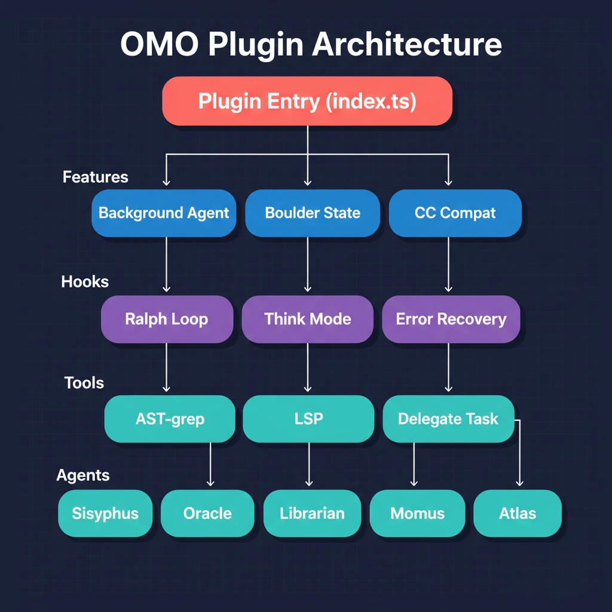

[English](./README.md) | [中文](./README-zh.md)

# 学习 Oh My OpenCode

> 跟随一条任务从头到尾，理解 OMO 的每一个齿轮。

## 这是什么

这不是 API 文档，也不是功能列表。这是一个**故事**：你对 OMO 说"帮我重构这个模块"，然后跟着这条任务走过整个系统——从 plugin 启动到 Ralph Loop 循环完成。

每一章从上一章结束的地方开始，每一章跟着代码走，每一章只讲一件事。

## 架构全景

## 章节目录

| # | 章节 | 故事线 |
|---|------|--------|
| 01 | [插件启动](./docs/zh/ch01-plugin-bootstrap.md) | OMO plugin 加载到 OpenCode，注册 hooks/tools/agents |
| 02 | [Sisyphus 接收任务](./docs/zh/ch02-sisyphus-planning.md) | Sisyphus 分析意图、评估代码库、制定计划 |
| 03 | [委派系统](./docs/zh/ch03-delegation.md) | delegate_task 把任务分给 Sisyphus-Junior + skills |
| 04 | [专家 Agents](./docs/zh/ch04-specialist-agents.md) | Oracle 思考、Explore 搜索、Librarian 查文档 |
| 05 | [Hook 管道](./docs/zh/ch05-hook-pipeline.md) | think-mode、rules 注入、context 管理透明增强 |
| 06 | [错误恢复](./docs/zh/ch06-error-recovery.md) | 编辑失败、session 崩溃、上下文溢出自动修复 |
| 07 | [后台执行](./docs/zh/ch07-background-agents.md) | 并行运行多个 agent，并发搜索与执行 |
| 08 | [动态 Prompt](./docs/zh/ch08-dynamic-prompts.md) | 每个 agent 的 prompt 根据可用资源现场拼装 |
| 09 | [增强工具](./docs/zh/ch09-crafted-tools.md) | AST-grep、LSP、interactive bash 超越原生能力 |
| 10 | [CC 兼容层](./docs/zh/ch10-cc-compatibility.md) | Claude Code 用户迁移无需改变任何配置 |
| 11 | [Ralph Loop](./docs/zh/ch11-ralph-loop.md) | 自动循环直到任务完成——OMO 的杀手级功能 |

## 阅读建议

**从头到尾读**——章节之间是连贯的故事线，每一章都建立在前一章之上。

**对照代码读**——每个代码片段都标注了文件路径和行号，打开源码对照理解更深。

## 源码

Oh My OpenCode: [GitHub](https://github.com/pchaganti/gx-opencode-omo)

## License

MIT
