```
 _                          ___  __  __  ___
| | ___  __ _ _ __ _ __    / _ \|  \/  |/ _ \
| |/ _ \/ _` | '__| '_ \  | | | | |\/| | | | |
| |  __/ (_| | |  | | | | | |_| | |  | | |_| |
|_|\___|\__,_|_|  |_| |_|  \___/|_|  |_|\___/

  深入解析 Oh My OpenCode —— OpenCode 的终极插件
  "最好的 Agent 是你能定制的那个"
```

# learn-OMO：Oh My OpenCode 源码深度解析

> **本项目灵感来自 [learn-claude-code](https://github.com/shareAI-lab/learn-claude-code)**，以 12 个渐进式章节拆解 Oh My OpenCode 的架构——从插件入口到多 Agent 协作、从 Hook 系统到 Ralph Loop 自动重试。

## 这是什么？

**Oh My OpenCode (OMO)** 不是一个独立的 AI Agent。它是 [OpenCode](https://github.com/sst/opencode) 的 **插件**——但它把 OpenCode 从一个普通的 AI 编程助手，变成了一个能与 Claude Code 正面对抗的多 Agent 协作平台。

引用作者的话：

> "If Claude Code does in 7 days what a human does in 3 months, Sisyphus does it in 1 hour."

本项目通过阅读 OMO 的**每一行源码**，揭示它是如何做到的。

## 🏛️ Agent 天团

OMO 最令人惊叹的设计是它的 **多 Agent 协作系统**。每个 Agent 都以希腊神话命名，各司其职：

```
┌─────────────────────────────────────────────────────┐
│                    SISYPHUS (主 Agent)                │
│  "推石上山的纪律之神" — 规划、委派、验证、交付        │
│  mode: primary | thinking: 32K budget               │
├─────────────────────────────────────────────────────┤
│                                                      │
│  ┌──────────┐  ┌──────────┐  ┌──────────┐          │
│  │  ORACLE   │  │  METIS   │  │  MOMUS   │  顾问层  │
│  │ 架构顾问  │  │ 规划预审  │  │ 计划审查  │          │
│  │ 只读/昂贵 │  │ 意图分类  │  │ 无情批判  │          │
│  └──────────┘  └──────────┘  └──────────┘          │
│                                                      │
│  ┌──────────┐  ┌──────────┐  ┌──────────┐          │
│  │ EXPLORE   │  │LIBRARIAN │  │  ATLAS   │  工作层  │
│  │ 代码搜索  │  │ 文档研究  │  │ 编排大师  │          │
│  │ 免费/并行 │  │ 免费/并行 │  │ 昂贵/主导 │          │
│  └──────────┘  └──────────┘  └──────────┘          │
│                                                      │
│  ┌───────────────┐  ┌───────────────────┐           │
│  │SISYPHUS-JUNIOR│  │MULTIMODAL-LOOKER  │  执行层   │
│  │ 轻量级执行者   │  │ 多模态文件分析     │           │
│  │ 不能委派他人   │  │ PDF/图片/图表      │           │
│  └───────────────┘  └───────────────────┘           │
│                                                      │
│  ┌──────────────────────────────────────────┐       │
│  │           PROMETHEUS (规划 Agent)          │       │
│  │  "盗火者" — 面试→研究→规划，绝不写代码     │       │
│  │  输出: .sisyphus/plans/*.md               │       │
│  └──────────────────────────────────────────┘       │
└─────────────────────────────────────────────────────┘
```

## 🧬 架构全景

```
                          OpenCode (宿主)
                               │
                     ┌─────────┴─────────┐
                     │  OhMyOpenCodePlugin │  ← src/index.ts
                     │  (Plugin 入口)      │
                     └─────────┬─────────┘
                               │
          ┌────────────────────┼────────────────────┐
          │                    │                     │
    ┌─────┴─────┐      ┌──────┴──────┐      ┌──────┴──────┐
    │  Features  │      │    Hooks    │      │    Tools    │
    │ (功能模块)  │      │ (事件钩子)  │      │  (工具集)   │
    └─────┬─────┘      └──────┬──────┘      └──────┬──────┘
          │                   │                     │
  ┌───────┼───────┐   ┌──────┼──────┐      ┌──────┼──────┐
  │background-    │   │ralph-loop   │      │ast-grep     │
  │agent          │   │think-mode   │      │lsp          │
  │tmux-subagent  │   │edit-error-  │      │delegate-task│
  │boulder-state  │   │recovery     │      │call-omo-    │
  │claude-code-*  │   │session-     │      │agent        │
  │context-       │   │recovery     │      │interactive- │
  │injector       │   │atlas        │      │bash         │
  │skill-mcp-     │   │background-  │      │skill        │
  │manager        │   │notification │      │slashcommand │
  └───────────────┘   └─────────────┘      └─────────────┘
```

## 🖼️ 架构全景信息图

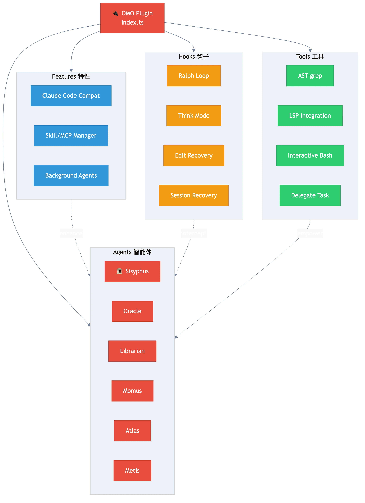

## 📚 12 个深度解析章节

| 章节 | 主题 | 格言 | 信息图 |
|------|------|------|--------|
| [s01](docs/zh/s01-plugin-architecture.md) | **插件架构** | "一切始于一个 Plugin 接口" | 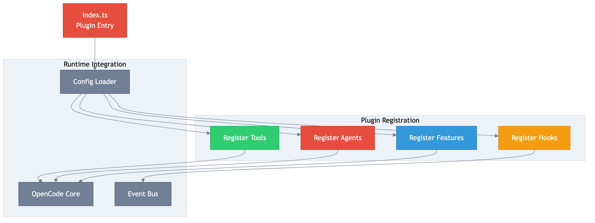 |
| [s02](docs/zh/s02-multi-agent-system.md) | **多 Agent 系统** | "每个 Agent 都以神命名，因为它们各有神力" | 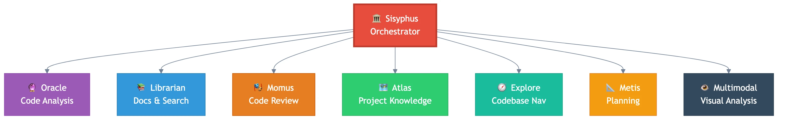 |
| [s03](docs/zh/s03-sisyphus-discipline-agent.md) | **Sisyphus：纪律之神** | "人类每天推石上山，你也一样" | 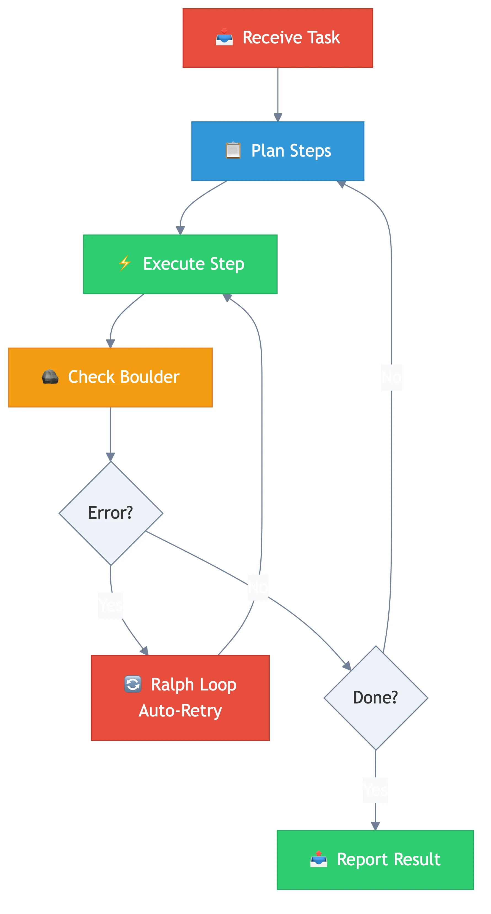 |
| [s04](docs/zh/s04-agent-delegation.md) | **Agent 委派机制** | "不委派的 Sisyphus 只是一个普通 Agent" | 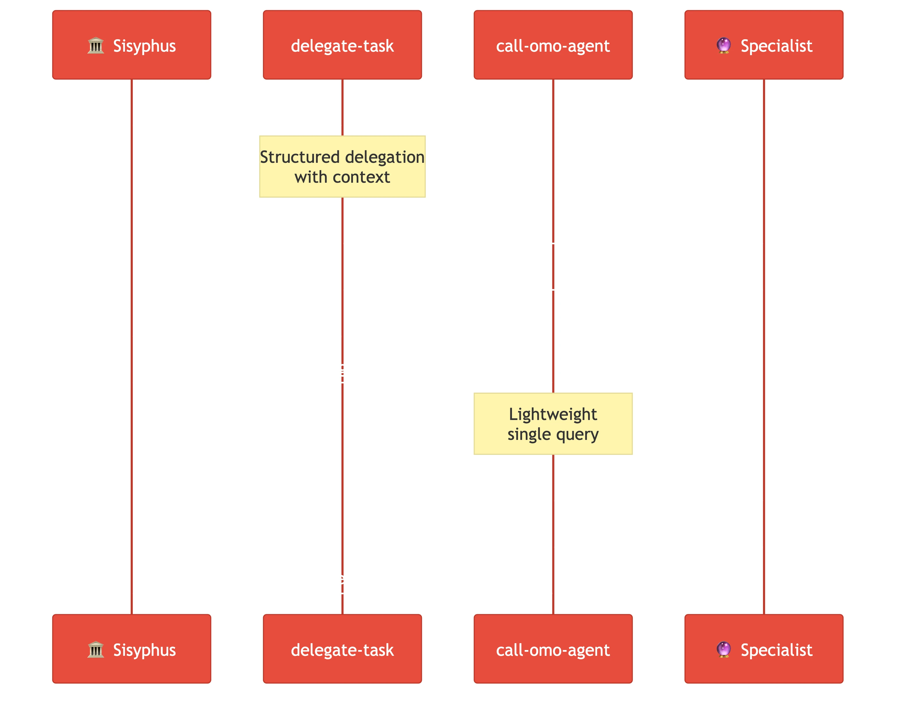 |
| [s05](docs/zh/s05-hook-system.md) | **Hook 系统** | "Hook 是 OMO 的神经系统" | 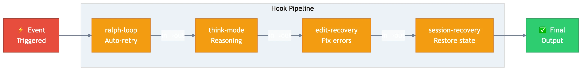 |
| [s06](docs/zh/s06-background-agents.md) | **后台 Agent** | "tmux 是穷人的容器编排" | 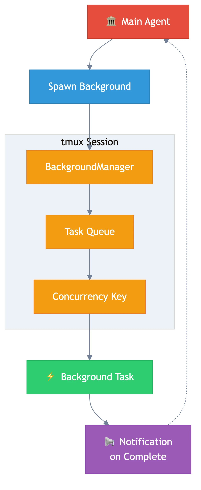 |
| [s07](docs/zh/s07-crafted-tools.md) | **精心打造的工具集** | "AST 搜索是 grep 的进化形态" | 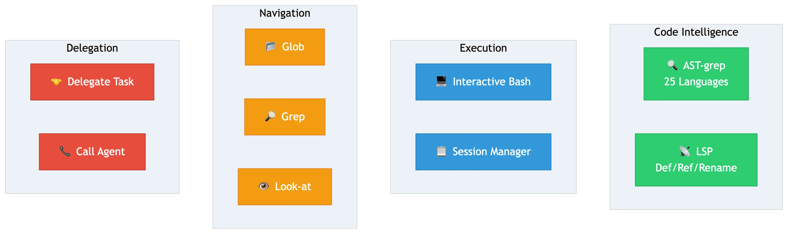 |
| [s08](docs/zh/s08-prompt-engineering.md) | **提示工程** | "Prompt 不是写的，是构建的" | 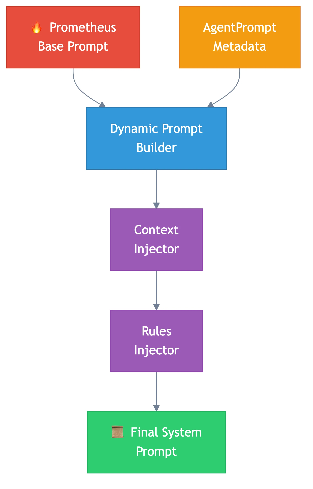 |
| [s09](docs/zh/s09-claude-code-compat.md) | **Claude Code 兼容层** | "最好的迁移是无感迁移" | 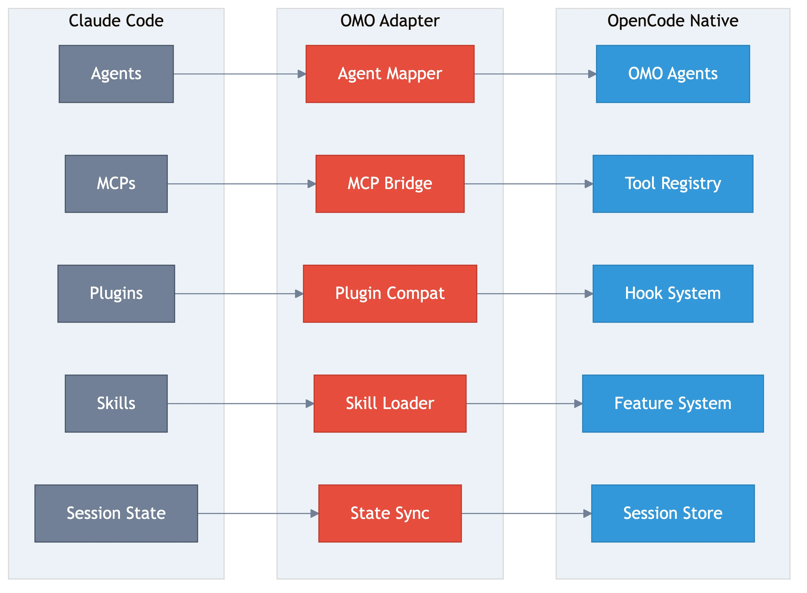 |
| [s10](docs/zh/s10-skill-mcp-management.md) | **Skill 与 MCP 管理** | "插件的插件，无限套娃" | 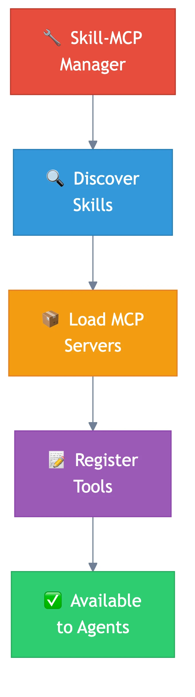 |
| [s11](docs/zh/s11-error-recovery.md) | **错误恢复与韧性** | "崩溃不是结束，是重启的开始" | 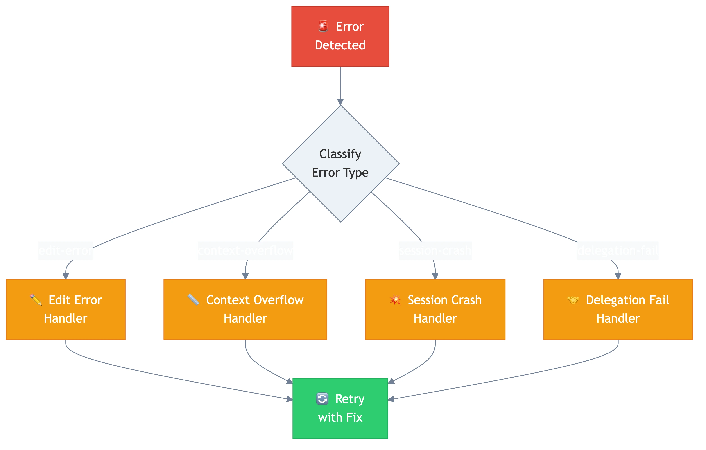 |
| [s12](docs/zh/s12-ralph-loop.md) | **Ralph Loop** | "做完了吗？没有？那继续。" | 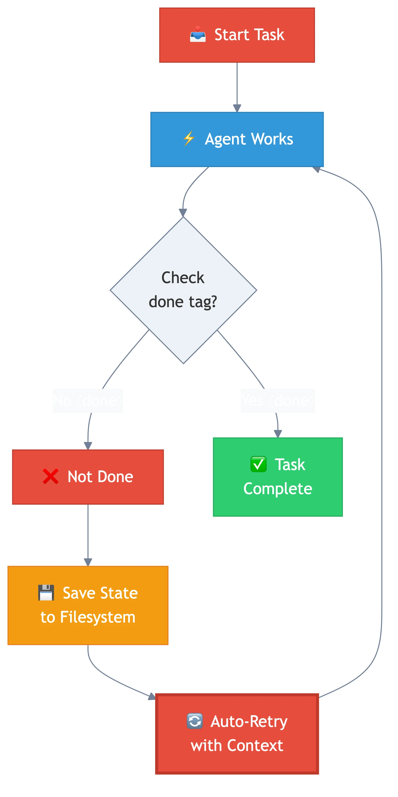 |

## 🗺️ 学习路径

```
入门：理解 OMO 是什么
  │
  ├── s01 插件架构 ──→ s02 多 Agent 系统
  │                         │
  │                    ┌────┴────┐
  │                    │         │
  │               s03 Sisyphus  s04 委派机制
  │                    │         │
  │                    └────┬────┘
  │                         │
  ├── s05 Hook 系统 ────────┤
  │                         │
  ├── s06 后台 Agent ───────┤
  │                         │
  ├── s07 工具集 ───────────┤
  │                         │
  ├── s08 提示工程 ─────────┤
  │                         │
  进阶：理解兼容性与扩展      │
  │                         │
  ├── s09 CC 兼容层 ────────┤
  │                         │
  ├── s10 Skill/MCP ────────┤
  │                         │
  精通：理解韧性设计          │
  │                         │
  ├── s11 错误恢复 ─────────┤
  │                         │
  └── s12 Ralph Loop ──── 完成！
```

## ⚔️ 对比：OpenCode vs OpenCode+OMO vs Claude Code

| 能力 | OpenCode (裸) | OpenCode + OMO | Claude Code |
|------|---------------|----------------|-------------|
| 基础编码 | ✅ | ✅ | ✅ |
| 多 Agent 协作 | ❌ | ✅ 8+ 专家 Agent | ✅ 内置 |
| 后台异步任务 | ❌ | ✅ tmux 隔离 | ✅ |
| 自动重试循环 | ❌ | ✅ Ralph Loop | ❌ |
| AST 感知搜索 | ❌ | ✅ ast-grep | ❌ |
| LSP 集成 | ❌ | ✅ 完整 LSP | 部分 |
| 计划→执行流水线 | ❌ | ✅ Prometheus→Atlas | ❌ |
| 计划审查 Agent | ❌ | ✅ Momus | ❌ |
| 持久化任务状态 | ❌ | ✅ Boulder State | ✅ |
| Hook 系统 | 插件级 | ✅ 30+ Hook | 内置 |
| Claude Code 兼容 | ❌ | ✅ Agent/MCP/Plugin | N/A |
| 可定制性 | 中等 | 极高 | 低 |

## 🪨 为什么叫 Sisyphus？

在希腊神话中，西西弗斯被罚永远推石上山。石头滚下来，他再推上去。

OMO 的核心 Agent 叫 **Sisyphus**，因为：
- 它不会放弃——Ralph Loop 保证它一直工作直到完成
- 它有纪律——严格的 TODO 跟踪、验证、委派
- 它的状态叫 **Boulder State**（巨石状态）——`.sisyphus/` 目录保存进度
- 它的计划叫 **Plans**——存在 `.sisyphus/plans/` 中
- **"Humans roll their boulder every day. So do you."**

这不只是命名。这是一种哲学：**伟大的工作来自纪律性的重复**。

## 🚀 开始阅读

从 [第一章：插件架构](docs/zh/s01-plugin-architecture.md) 开始。

每一章都包含：
- 📝 **真实源码**——引用自 `/tmp/omo-src/` 的 TypeScript 代码
- 📊 **架构图**——ASCII 图展示组件关系
- 🔍 **问题→方案→代码** 格式
- 🆚 **对比分析**——OMO vs OpenCode vs Claude Code

---

**如果这个项目对你有帮助，请给 [Oh My OpenCode](https://github.com/code-yeongyu/oh-my-opencode) 一个 Star ⭐**

---

*本项目仅用于教育目的。所有代码引用来自 Oh My OpenCode 开源仓库。*
