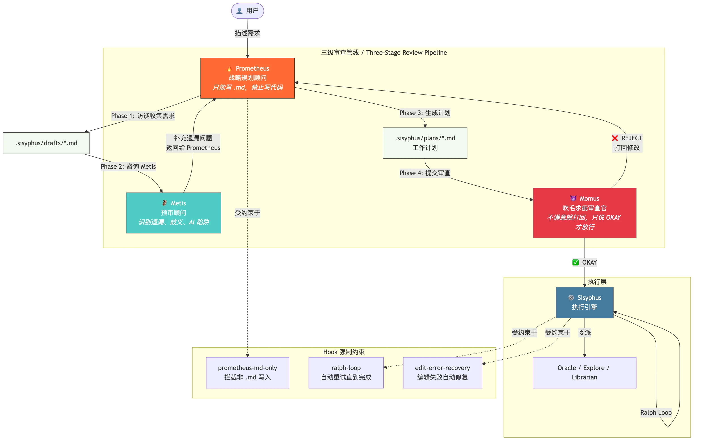

# Oh My OpenCode 架构设计

> 面向高级开发者的架构速览。5-10 分钟读懂 OMO 的设计哲学与关键机制。

## 30 秒速览

OMO 是一个 OpenCode 插件，通过 **8+ 专家 Agent** + **Hook 管道** + **自动重试循环** 把一个通用的 AI 编码工具变成可靠的工程系统。核心创新是 **Prometheus→Metis→Momus 三级审查管线**——借鉴 GAN 的 Generator/Evaluator 分离思想，让规划者（Prometheus）禁止写代码，审查者（Momus）不满意就反复打回，从而对抗 AI "自己检查自己" 的盲区。



---

## 核心设计决策

| 决策 | 原因 | 代价 |
|------|------|------|
| Agent 只能通过 `delegate_task` 委派，不直接复用 | 每个 Agent 有独立 system prompt 和工具白名单，职责不会混 | 多了一层调度开销 |
| Prometheus 只能写 `.md`（Hook 强制） | 规划者永远不会"顺手"把代码写了，保持 Planner≠Implementer | 需要额外的 Hook 拦截层 |
| Momus 审查不关心方案好坏，只关心文档完整性 | 防止审查者越权改方案，专注 "能不能按计划执行" | 不会拦截差的架构方案 |
| Ralph Loop 自动重试直到完成 | AI 经常在一次 turn 内完不成任务，循环保证结果 | 有 max_iterations 上限（默认 100） |
| Hook 管道透明增强 | Agent 不知道自己被 Hook 修改了行为，保持 prompt 简洁 | Debug 时需要理解 Hook 链 |
| 背景 Agent 通过 tmux 并行 | 不阻塞主对话，并发探索多个方向 | 需要 tmux、并发控制 |

---

## Agent 编排模式

### 模式 1：Sisyphus 单循环（简单任务）

用户说 "把这个变量名改了"，Sisyphus 直接用工具执行，Ralph Loop 确认完成。

```
User → Sisyphus → [直接使用工具] → Ralph Loop 检查 <promise>DONE</promise> → 完成
```

Sisyphus 的意图分类逻辑（`src/agents/sisyphus.ts`）：

```typescript
// Phase 0 - Intent Gate (EVERY message)
// Step 1: Classify Request Type
// | Trivial  | Single file, known location  | Direct tools only |
// | Explicit | Specific file/line, clear cmd | Execute directly   |
```

### 模式 2：Sisyphus + 专家委派（中等任务）

Sisyphus 判断自己不够格，委派给专家：

| Agent | 角色 | 成本 |
|-------|------|------|
| **Explore** | 代码库内部搜索（"grep 级别"） | FREE |
| **Librarian** | 外部文档/开源代码搜索 | CHEAP |
| **Oracle** | 架构级决策、深度推理 | EXPENSIVE |

```typescript
// src/agents/sisyphus.ts — 默认行为是委派
// **Default Bias: DELEGATE. WORK YOURSELF ONLY WHEN IT IS SUPER SIMPLE.**

// 并行发射 explore + librarian（从不同步等待）
delegate_task(subagent_type="explore", run_in_background=true, prompt="Find auth implementations...")
delegate_task(subagent_type="librarian", run_in_background=true, prompt="Find JWT best practices...")
// 继续工作，稍后用 background_output 收集结果
```

### 模式 3：Prometheus→Metis→Momus 三级审查（复杂任务） ⭐

**这是 OMO 最核心的设计。** 灵感来源于 Anthropic 的研究：将 Planner、Generator、Evaluator 分离，类似 GAN 中 Generator 与 Discriminator 的对抗训练——规划者不能自己执行，执行者不能自己审查。

#### 阶段 1：Prometheus 访谈 — "你要什么？"

Prometheus 是战略顾问，**被禁止写任何代码**。这不是靠 prompt 约束——而是靠 Hook 硬性拦截。

```typescript
// src/agents/prometheus-prompt.ts
export const PROMETHEUS_SYSTEM_PROMPT = `
# Prometheus - Strategic Planning Consultant

## CRITICAL IDENTITY (READ THIS FIRST)
**YOU ARE A PLANNER. YOU ARE NOT AN IMPLEMENTER. YOU DO NOT WRITE CODE.**

| User Says              | You Interpret As                        |
|------------------------|-----------------------------------------|
| "Fix the login bug"    | "Create a work plan to fix the login bug" |
| "Add dark mode"        | "Create a work plan to add dark mode"     |

**FORBIDDEN ACTIONS (WILL BE BLOCKED BY SYSTEM):**
- Writing code files (.ts, .js, .py, .go, etc.)
- Editing source code
- Running implementation commands

**YOUR ONLY OUTPUTS:**
- Questions to clarify requirements
- Research via explore/librarian agents
- Work plans saved to \`.sisyphus/plans/*.md\`
`
```

**Hook 强制执行**（`src/hooks/prometheus-md-only/constants.ts`）：

```typescript
export const PROMETHEUS_AGENTS = ["prometheus"]
export const ALLOWED_EXTENSIONS = [".md"]
export const ALLOWED_PATH_PREFIX = ".sisyphus"
export const BLOCKED_TOOLS = ["Write", "Edit", "write", "edit"]
```

即使 Prometheus 试图写 `.ts` 文件，Hook 会直接 `throw`，调用被拦截。

#### 阶段 2：Metis 预审 — "你漏了什么？"

在生成计划前，Prometheus 必须咨询 Metis。Metis 是智慧女神，专门发现隐藏意图和 AI 常见陷阱。

```typescript
// src/agents/metis.ts
export const METIS_SYSTEM_PROMPT = `# Metis - Pre-Planning Consultant

## CONSTRAINTS
- **READ-ONLY**: You analyze, question, advise. You do NOT implement or modify files.

## PHASE 0: INTENT CLASSIFICATION (MANDATORY FIRST STEP)
| Intent        | Your Primary Focus                                    |
|---------------|-------------------------------------------------------|
| **Refactoring**   | SAFETY: regression prevention, behavior preservation  |
| **Build from Scratch** | DISCOVERY: explore patterns first               |
| **Mid-sized Task**     | GUARDRAILS: exact deliverables, explicit exclusions |
`
```

Metis 的关键能力是**识别 AI Slop 模式**：

```typescript
// src/agents/metis.ts — AI-Slop Patterns to Flag
// | Scope inflation      | "Also tests for adjacent modules" |
// | Premature abstraction | "Extracted to utility"           |
// | Over-validation       | "15 error checks for 3 inputs"  |
// | Documentation bloat   | "Added JSDoc everywhere"         |
```

#### 阶段 3：Momus 审查 — "不行，打回去"

Momus 以希腊挑剔之神命名。他审查计划，直到满意才输出 `OKAY`。

```typescript
// src/agents/momus.ts
/**
 * Named after Momus, the Greek god of satire and mockery, who was known for
 * finding fault in everything - even the works of the gods themselves.
 * He criticized Aphrodite (found her sandals squeaky), Hephaestus (said man
 * should have windows in his chest to see thoughts), and Athena (her house
 * should be on wheels to move from bad neighbors).
 */

export const MOMUS_SYSTEM_PROMPT = `
**ABSOLUTE CONSTRAINT - RESPECT THE IMPLEMENTATION DIRECTION**:
You are a REVIEWER, not a DESIGNER. The implementation direction in the plan
is **NOT NEGOTIABLE**. Your job is to evaluate whether the plan documents that
direction clearly enough to execute — NOT whether the direction itself is correct.

**REJECT if**: When you simulate actually doing the work, you cannot obtain clear
information needed for implementation.

**Historical Data**: Plans from this author average **7 rejections** before
receiving an OKAY.
`
```

**关键约束**：Momus 不评判方案好坏，只评判文档完整性。这防止了审查者越权。

#### 完整管线流转

```
prometheus-md-only Hook 中定义的工作流（src/hooks/prometheus-md-only/constants.ts）：

┌──────┬──────────────────────────────────────────────────┐
│  1   │ INTERVIEW: Prometheus 访谈用户，记录到 drafts/   │
│  2   │ METIS CONSULTATION: 预审，发现遗漏              │
│  3   │ PLAN GENERATION: 生成计划到 plans/*.md           │
│  4   │ MOMUS REVIEW: 审查循环，直到 OKAY               │
│  5   │ SUMMARY: 呈现给用户，引导执行                   │
└──────┴──────────────────────────────────────────────────┘
```

#### GAN 类比

| GAN 概念 | OMO 对应 | 作用 |
|----------|----------|------|
| Generator | Prometheus（规划） + Sisyphus（执行） | 生成计划和代码 |
| Discriminator | Momus（审查） | 评判质量，不满意就打回 |
| 训练循环 | Momus REJECT → Prometheus 修改 → 重新提交 | 对抗式迭代提升质量 |

传统 AI 编码工具让同一个 AI 既写代码又检查自己——相当于 GAN 里只有 Generator 没有 Discriminator。OMO 通过角色分离 + Hook 强制执行，确保 "生成" 和 "评判" 是独立的。

### 模式 4：后台并行（大型任务）

通过 `BackgroundManager`（`src/features/background-agent/manager.ts`）在 tmux 中并行运行多个 Agent：

```typescript
// src/features/background-agent/concurrency.ts
// 支持三级并发控制：
// 1. modelConcurrency: 每个模型的并发上限
// 2. providerConcurrency: 每个供应商的并发上限  
// 3. defaultConcurrency: 全局默认上限（默认 5）
```

Atlas 是大型任务的总指挥（`src/agents/atlas.ts`），通过 `delegate_task()` 编排所有子任务直到全部完成。

---

## Hook 系统设计

Hook 是 OMO 的"隐形骨架"——Agent 不知道自己被修改了行为，但 Hook 在每个关键节点注入约束。

| Hook | 触发时机 | 作用 |
|------|----------|------|
| `prometheus-md-only` | `tool.execute.before` | 拦截 Prometheus 写非 `.md` 文件 |
| `ralph-loop` | `event`（session 结束时） | 检测是否输出完成标记，没有就自动重试 |
| `edit-error-recovery` | `tool.execute.after` | 检测编辑失败，注入修复提示 |
| `think-mode` | `session.prompt.before` | 根据任务复杂度切换思考模式 |
| `rules-injection` | `session.prompt.before` | 注入项目规则和上下文 |

Hook 的核心模式是 **before/after 拦截**：

```typescript
// before: 可以修改输入或抛出异常阻止执行
"tool.execute.before": async (input, output) => {
  if (isBlocked) throw new Error("can only write/edit .md files")
}

// after: 可以修改输出（如注入修复提示）
"tool.execute.after": async (input, output) => {
  if (hasError) output.output += EDIT_ERROR_REMINDER
}
```

---

## 错误恢复设计

OMO 有三层错误恢复机制：

### 1. 编辑错误自动修复（`edit-error-recovery`）

```typescript
// src/hooks/edit-error-recovery/index.ts
export const EDIT_ERROR_PATTERNS = [
  "oldString and newString must be different",
  "oldString not found",
  "oldString found multiple times",
]

// 检测到错误后注入修复指令：
// 1. READ the file to see its ACTUAL current state
// 2. VERIFY what the content really looks like
// 3. CONTINUE with corrected action
```

### 2. Ralph Loop 自动重试

```typescript
// src/hooks/ralph-loop/constants.ts
export const DEFAULT_MAX_ITERATIONS = 100
export const DEFAULT_COMPLETION_PROMISE = "DONE"
export const COMPLETION_TAG_PATTERN = /<promise>(.*?)<\/promise>/is

// 每次 session 结束时检查是否输出了 <promise>DONE</promise>
// 没有 → 自动发送 continuation prompt，带上迭代计数
```

### 3. Sisyphus 的 3 次失败熔断

```typescript
// src/agents/sisyphus.ts
// After 3 Consecutive Failures:
// 1. STOP all further edits immediately
// 2. REVERT to last known working state
// 3. DOCUMENT what was attempted
// 4. CONSULT Oracle with full failure context
// 5. If Oracle cannot resolve → ASK USER
```

---

## 动态 Prompt 组装

每个 Agent 的 prompt 不是静态的——`dynamic-agent-prompt-builder.ts` 根据当前可用的工具、Agent 和 Skills 动态拼装。

```typescript
// src/agents/dynamic-agent-prompt-builder.ts
export function buildKeyTriggersSection(agents: AvailableAgent[], skills: AvailableSkill[]): string
export function buildToolSelectionTable(agents: AvailableAgent[], tools: AvailableTool[]): string
export function buildExploreSection(agents: AvailableAgent[]): string
export function buildLibrarianSection(agents: AvailableAgent[]): string
export function buildDelegationTable(agents: AvailableAgent[]): string
export function buildOracleSection(agents: AvailableAgent[]): string
```

这意味着如果你安装了额外的 Agent 或工具，Sisyphus 的 prompt 会自动包含它们的使用指南。

---

## 关键代码入口索引

| 我想理解… | 读这个文件 |
|-----------|-----------|
| 主编排逻辑 | `src/agents/sisyphus.ts` |
| 三级审查 — 规划 | `src/agents/prometheus-prompt.ts` |
| 三级审查 — 预审 | `src/agents/metis.ts` |
| 三级审查 — 审查 | `src/agents/momus.ts` |
| 规划者不能写代码的强制机制 | `src/hooks/prometheus-md-only/` |
| 自动重试循环 | `src/hooks/ralph-loop/` |
| 编辑错误恢复 | `src/hooks/edit-error-recovery/` |
| 后台并发执行 | `src/features/background-agent/` |
| 动态 Prompt 拼装 | `src/agents/dynamic-agent-prompt-builder.ts` |
| 架构级顾问 | `src/agents/oracle.ts` |
| 代码库搜索 | `src/agents/explore.ts` |
| 外部文档搜索 | `src/agents/librarian.ts` |
| 大型任务编排 | `src/agents/atlas.ts` |
