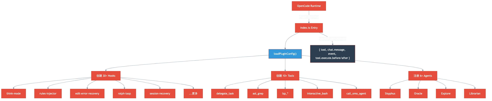

# 第一章：插件启动 — index.ts 如何挂载一切

> **格言**：*"一个好的编排者，在第一行代码里就决定了整场战役的走向。"*

## 起点

你输入了一条消息："帮我重构这个模块"。OpenCode 收到了。但在 Sisyphus 看到你的任务之前，OMO 插件需要先完成自己的启动仪式。这一章，我们跟着 `index.ts` 走一遍——看它如何在几百毫秒内组装出一整套 hooks、tools 和 agents。

## 问题

OpenCode 本身是个通用 AI 编程助手。它不知道该用哪个模型思考、出错了怎么恢复、大任务怎么拆分。OMO 插件的职责就是**把这些能力注册进去**——通过 OpenCode 的 Plugin 接口。

## 代码路径

### 入口：Plugin 函数签名

```typescript
// src/index.ts:L78
const OhMyOpenCodePlugin: Plugin = async (ctx) => {
  startTmuxCheck();
  const pluginConfig = loadPluginConfig(ctx.directory, ctx);
  const disabledHooks = new Set(pluginConfig.disabled_hooks ?? []);
  // ...
```

`ctx` 是 OpenCode 传入的上下文，包含 `client`（API 客户端）和 `directory`（工作目录）。第一件事：加载配置，确定哪些 hooks 被禁用。

### Hook 注册：逐个创建

```typescript
// src/index.ts:L90-L130
const contextWindowMonitor = isHookEnabled("context-window-monitor")
  ? createContextWindowMonitorHook(ctx) : null;
const sessionRecovery = isHookEnabled("session-recovery")
  ? createSessionRecoveryHook(ctx, { experimental: pluginConfig.experimental }) : null;
const thinkMode = isHookEnabled("think-mode") ? createThinkModeHook() : null;
const ralphLoop = isHookEnabled("ralph-loop")
  ? createRalphLoopHook(ctx, { config: pluginConfig.ralph_loop, ... }) : null;
const editErrorRecovery = isHookEnabled("edit-error-recovery")
  ? createEditErrorRecoveryHook(ctx) : null;
```

每个 hook 都是"按需创建"——如果配置里禁用了，就返回 `null`。这是整个插件的**开关系统**。

### Tool 注册：组装工具箱

```typescript
// src/index.ts:L190-L220
const callOmoAgent = createCallOmoAgent(ctx, backgroundManager);
const delegateTask = createDelegateTask({ manager: backgroundManager, client: ctx.client, ... });
const skillTool = createSkillTool({ skills: mergedSkills, mcpManager: skillMcpManager, ... });
```

`delegate_task` 是 Sisyphus 的核心武器——它让主 agent 能把任务分配给子 agent。`call_omo_agent` 允许直接调用特定专家。

### 返回值：Plugin 契约

```typescript
// src/index.ts:L300-L400
return {
  tool: { ...builtinTools, ...backgroundTools, call_omo_agent, delegate_task, skill, interactive_bash, ... },
  "chat.message": async (input, output) => { /* hook 链 */ },
  event: async (input) => { /* 事件分发 */ },
  "tool.execute.before": async (input, output) => { /* 工具前置拦截 */ },
  "tool.execute.after": async (input, output) => { /* 工具后置拦截 */ },
};
```

这就是 OMO 与 OpenCode 的**契约**。它注册了：

| 接口 | 作用 |
|------|------|
| `tool` | 所有可用工具（delegate_task, ast_grep, lsp_*, interactive_bash...） |
| `chat.message` | 消息到达时的 hook 链（关键词检测、Ralph Loop 启动...） |
| `event` | 系统事件处理（session 创建/销毁、错误恢复...） |
| `tool.execute.before` | 工具执行前拦截（规则注入、参数修改...） |
| `tool.execute.after` | 工具执行后拦截（错误恢复、输出截断...） |

### 事件分发：一个入口，所有 hook

```typescript
// src/index.ts:L350-L380
event: async (input) => {
  await autoUpdateChecker?.event(input);
  await claudeCodeHooks.event(input);
  await contextWindowMonitor?.event(input);
  await rulesInjector?.event(input);
  await thinkMode?.event(input);
  await anthropicContextWindowLimitRecovery?.event(input);
  await ralphLoop?.event(input);
  await atlasHook?.handler(input);
  // ...session 生命周期管理
}
```

所有 hook 被串成一条链。每个事件经过每个 hook，hook 自己决定是否处理。

## 架构图



## 关键洞察

**OMO 不是一个 agent，是一个 agent 平台。** `index.ts` 的工作不是思考——是组装。它在启动时把 30+ 个 hooks、10+ 个 tools、6+ 个 agents 全部注册到 OpenCode 里，然后退到幕后。从此以后，每条消息、每次工具调用、每个系统事件，都会经过这张精心编织的网。

配置决定了这张网的形状。`disabled_hooks` 可以关闭任何 hook，`disabled_agents` 可以移除任何 agent。这不是写死的——是可配置的编排。

## 下一步

Plugin 已经挂载完毕。现在，你的消息"帮我重构这个模块"穿过了 `chat.message` hook 链，到达了 Sisyphus。它会怎么处理？

→ [第二章：Sisyphus 接收任务](./ch02-sisyphus-planning.md)
