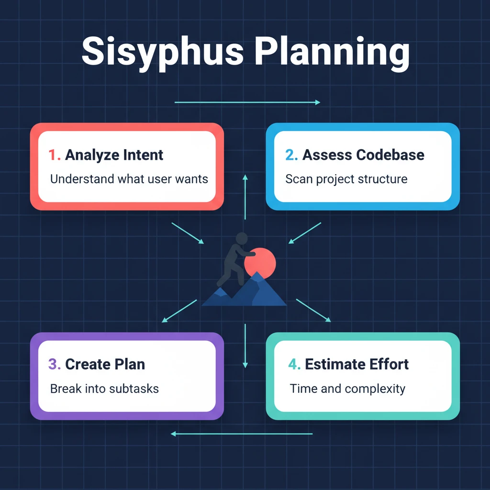

# 第二章：Sisyphus 接收任务 — 从消息到计划

> **格言**：*"Sisyphus 每天推巨石上山。你每天写代码。我们没什么不同——你的代码应该和高级工程师写的没区别。"*

## 上回

[上一章](./ch01-plugin-bootstrap.md)中，OMO 插件完成了启动，把 hooks、tools、agents 全部注册到 OpenCode。你的消息"帮我重构这个模块"现在穿过了 `chat.message` hook 链，到达了 Sisyphus。

## 问题

一条模糊的请求来了："帮我重构这个模块"。Sisyphus 不能立刻动手——它需要先**理解意图、评估代码库、制定计划**。这是 Phase 0 到 Phase 1 的过程。

## 代码路径

### Sisyphus 的身份定义

```typescript
// src/agents/sisyphus.ts:L30-L40
return `<Role>
You are "Sisyphus" - Powerful AI Agent with orchestration capabilities from OhMyOpenCode.
**Why Sisyphus?**: Humans roll their boulder every day. So do you.
**Identity**: SF Bay Area engineer. Work, delegate, verify, ship. No AI slop.
**Core Competencies**:
- Parsing implicit requirements from explicit requests
- Adapting to codebase maturity (disciplined vs chaotic)
- Delegating specialized work to the right subagents
</Role>`
```

Sisyphus 的 prompt 不是手写的——它是**动态组装**的（详见[第八章](./ch08-dynamic-prompts.md)）。但核心身份始终不变：一个注重实效的旧金山工程师。

### Phase 0：意图分类（每条消息必经）

```typescript
// src/agents/sisyphus.ts (prompt 内)
// Phase 0 - Intent Gate (EVERY message)
// Step 1: Classify Request Type
| Type         | Signal                               | Action                        |
|--------------|--------------------------------------|-------------------------------|
| Trivial      | Single file, known location          | Direct tools only             |
| Explicit     | Specific file/line, clear command    | Execute directly              |
| Exploratory  | "How does X work?"                   | Fire explore + tools parallel |
| Open-ended   | "Improve", "Refactor", "Add feature"| Assess codebase first         |
| Ambiguous    | Unclear scope                        | Ask ONE clarifying question   |
```

"帮我重构这个模块" → 归类为 **Open-ended**。Sisyphus 的下一步是评估代码库。

### Phase 1：代码库评估

```typescript
// src/agents/sisyphus.ts (prompt 内)
// State Classification:
| State          | Signals                                    | Behavior               |
|----------------|--------------------------------------------|-----------------------|
| Disciplined    | Consistent patterns, configs, tests        | Follow existing style  |
| Transitional   | Mixed patterns                             | Ask which to follow    |
| Legacy/Chaotic | No consistency                             | Propose conventions    |
| Greenfield     | New/empty project                          | Modern best practices  |
```

Sisyphus 不会盲目跟随现有模式——它会先判断这些模式**值不值得跟随**。

### 委派检查（强制性）

```typescript
// src/agents/sisyphus.ts (prompt 内)
// Delegation Check (MANDATORY before acting directly):
// 1. Is there a specialized agent that perfectly matches?
// 2. If not, is there a delegate_task category?
// 3. Can I do it myself for SURE?
// Default Bias: DELEGATE. WORK YOURSELF ONLY WHEN SUPER SIMPLE.
```

这是 Sisyphus 的核心原则：**能委派就委派**。它不是"能干活的 agent"——它是"指挥别人干活的 agent"。

### Todo 纪律

```typescript
// src/agents/sisyphus.ts (prompt 内)
// DEFAULT BEHAVIOR: Create todos BEFORE starting any non-trivial task.
// 1. IMMEDIATELY on receiving request: todowrite to plan atomic steps
// 2. Before starting each step: Mark in_progress (only ONE at a time)
// 3. After completing each step: Mark completed IMMEDIATELY
// 4. If scope changes: Update todos before proceeding
```

Todo 不是可选的——它是 Sisyphus 的"进度条"。用户可以实时看到 agent 在做什么。

### Agent 创建：模型适配

```typescript
// src/agents/sisyphus.ts:L250-L265
export function createSisyphusAgent(model, availableAgents, ...): AgentConfig {
  const base = {
    mode: "primary",
    model,
    maxTokens: 64000,
    prompt, // 动态生成的 prompt
    color: "#00CED1",
  };
  if (isGptModel(model)) {
    return { ...base, reasoningEffort: "medium" };
  }
  return { ...base, thinking: { type: "enabled", budgetTokens: 32000 } };
}
```

Claude 用 extended thinking（budgetTokens: 32000），GPT 用 reasoningEffort: "medium"。同一个 Sisyphus，不同的思考方式。

## 架构图



## 关键洞察

**Sisyphus 的第一反应不是"干活"，而是"谁来干"。** 收到任务后，它走过一条固定的决策链：分类意图 → 评估代码库 → 检查是否该委派 → 创建 todo → 然后才开始行动。这个流程不是建议——它写在 prompt 里，用 `MANDATORY`、`NON-NEGOTIABLE` 这样的词强制执行。

这就是 OMO 的哲学：**编排优于执行**。Sisyphus 像项目经理一样思考，只在"超级简单"的时候才亲自动手。

## 下一步

Sisyphus 评估完代码库，决定"这个重构任务太大了，我不该自己干"。它打开了委派系统。

→ [第三章：委派系统](./ch03-delegation.md)
