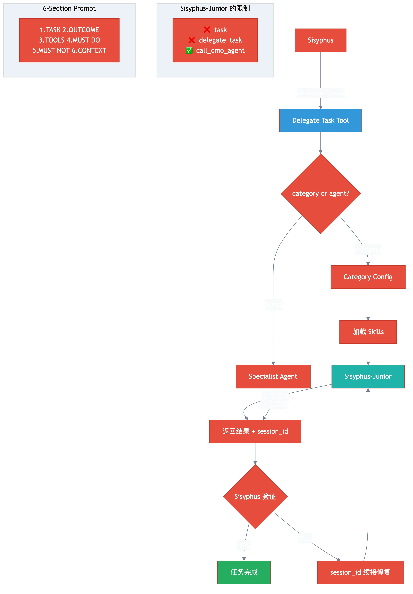

# 第三章：委派系统 — delegate_task 与任务分发

> **格言**：*"好的将军不亲自冲锋，好的编排者不亲自写代码。"*

## 上回

[上一章](./ch02-sisyphus-planning.md)中，Sisyphus 收到了你的重构任务，经过意图分类和代码库评估后，决定委派而非亲自执行。现在它要使用 `delegate_task` 工具。

## 问题

Sisyphus 要把"重构这个模块"拆成多个子任务，分配给不同的执行者。但执行者有很多种——有 category（领域优化的模型配置），有 agent（专家系统），还有 skill（注入式专业知识）。怎么选？

## 代码路径

### delegate_task 的创建

```typescript
// src/index.ts:L205-L215
const delegateTask = createDelegateTask({
  manager: backgroundManager,
  client: ctx.client,
  directory: ctx.directory,
  userCategories: pluginConfig.categories,
  gitMasterConfig: pluginConfig.git_master,
  sisyphusJuniorModel: pluginConfig.agents?.["sisyphus-junior"]?.model,
  browserProvider,
});
```

`delegate_task` 在 plugin 启动时就创建好了，它持有 `BackgroundManager`（后台执行器）和 `client`（OpenCode API）的引用。

### Sisyphus-Junior：真正的执行者

```typescript
// src/agents/sisyphus-junior.ts:L5-L20
const SISYPHUS_JUNIOR_PROMPT = `<Role>
Sisyphus-Junior - Focused executor from OhMyOpenCode.
Execute tasks directly. NEVER delegate or spawn other agents.
</Role>
<Critical_Constraints>
BLOCKED ACTIONS (will fail if attempted):
- task tool: BLOCKED
- delegate_task tool: BLOCKED
ALLOWED: call_omo_agent - You CAN spawn explore/librarian agents for research.
</Critical_Constraints>`
```

当 Sisyphus 用 `delegate_task(category="quick")` 委派任务时，实际执行的是 **Sisyphus-Junior**——一个被剥夺了委派能力的"干活版 Sisyphus"。它能用 `call_omo_agent` 调研，但**不能再委派**。这防止了无限递归。

### Category 系统：领域优化

```typescript
// src/tools/delegate-task/tools.ts (内部)
// delegate_task(category="quick", load_skills=["skill-1"], prompt="...")
// → 创建 Sisyphus-Junior，注入 category 配置（温度、模型）+ skill 内容
```

Category 是预配置的执行环境：

| Category | 温度 | 用途 |
|----------|------|------|
| `quick` | 低 | 快速、明确的小任务 |
| `visual-engineering` | 中 | 前端 UI 工作 |
| `ultrabrain` | 低 | 需要深度思考的复杂任务 |

### Skill 注入：专业知识前置

```typescript
// src/tools/delegate-task/tools.ts (内部)
// load_skills=["skill-1", "skill-2"]
// → resolveMultipleSkillsAsync(skills)
// → 读取 skill 内容，拼接到子 agent 的 prompt 前面
```

Skills 是 Markdown 文件，包含特定领域的规则和模式。当 Sisyphus 说 `load_skills=["react-patterns"]` 时，这个 skill 的内容会被**注入到 Sisyphus-Junior 的 prompt 开头**，让它在执行时带着领域知识。

### Session 续接：记忆传递

```typescript
// src/agents/sisyphus.ts (prompt 内)
// ALWAYS continue when:
// | Task failed/incomplete | session_id="{session_id}", prompt="Fix: {error}" |
// | Follow-up question     | session_id="{session_id}", prompt="Also: {question}" |
```

每次 `delegate_task()` 返回一个 `session_id`。如果任务失败了，Sisyphus 用**同一个 session_id** 继续——子 agent 保留了完整的对话上下文，不需要重新读文件、重新理解代码。这**节省 70%+ 的 token**。

### 6-Section Prompt 结构

Sisyphus 委派任务时，prompt 必须包含 6 个部分：

```
1. TASK: 原子化、具体的目标
2. EXPECTED OUTCOME: 具体的交付物和验收标准
3. REQUIRED TOOLS: 明确的工具白名单
4. MUST DO: 详尽的要求——不留隐含假设
5. MUST NOT DO: 禁止的行为——预防越界
6. CONTEXT: 文件路径、已有模式、约束条件
```

## 架构图



## 关键洞察

**委派不是"把活扔出去"，是"精确制导"。** Sisyphus 的委派协议要求每次委派都带有 6 段式 prompt——任务描述、预期结果、工具白名单、必须做、禁止做、上下文。这不是形式主义，是**防止子 agent 跑偏的围栏**。

Category 选模型和参数，Skill 注入领域知识，Session ID 保持记忆。三者结合，让每次委派都是**精确的、有知识的、有记忆的**。

## 下一步

Sisyphus 委派了任务，但有些工作不适合 Sisyphus-Junior——需要只读的深度分析（Oracle）、代码搜索（Explore）或外部文档查找（Librarian）。

→ [第四章：专家 Agents](./ch04-specialist-agents.md)
