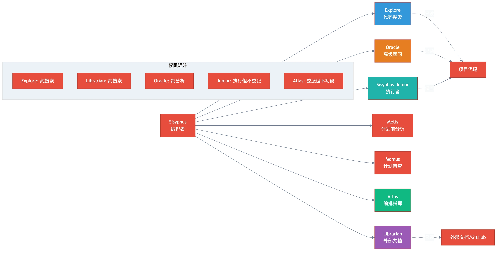

# 第四章：专家 Agents — 每个角色的真正职责

> **格言**：*"不是每个问题都需要同一把锤子。Oracle 思考，Explore 搜索，Librarian 查阅，各司其职。"*

## 上回

[上一章](./ch03-delegation.md)中，我们看到 Sisyphus 如何通过 `delegate_task` 把任务分发给 Sisyphus-Junior 执行。但有些工作需要专家——不是执行代码修改，而是**搜索、分析、审查**。

## 问题

重构过程中，Sisyphus 需要：了解模块的依赖关系、查找外部库的最佳实践、在修改后做架构审查。这三件事需要三种不同的专家。

## 代码路径

### Explore — 代码库的搜索引擎

```typescript
// src/agents/explore.ts:L28-L35
description: 'Contextual grep for codebases. Answers "Where is X?", 
  "Which file has Y?", "Find the code that does Z". 
  Fire multiple in parallel for broad searches.',
mode: "subagent",
```

Explore 是**只读**的（不能写入/编辑），用于在项目内搜索代码。Sisyphus 把它当 `grep` 用——但更聪明，能理解语义：

```typescript
// src/agents/explore.ts (prompt 内)
// 工具策略:
// - Semantic search (definitions, references): LSP tools
// - Structural patterns (function shapes): ast_grep_search
// - Text patterns (strings, comments): grep
// - File patterns (find by name): glob
```

**关键约束**：Explore 被禁止使用 `write`, `edit`, `task`, `delegate_task`, `call_omo_agent`。纯搜索，无副作用。

### Librarian — 外部世界的窗口

```typescript
// src/agents/librarian.ts:L25-L30
description: "Specialized codebase understanding agent for multi-repository analysis, 
  searching remote codebases, retrieving official documentation...",
mode: "subagent",
```

Librarian 负责**外部信息**：GitHub 仓库、官方文档、Stack Overflow。它有一套系统化的研究流程：

```typescript
// src/agents/librarian.ts (prompt 内)
// PHASE 0.5: DOCUMENTATION DISCOVERY
// Step 1: websearch("library-name official documentation site")
// Step 2: Version check (if specified)
// Step 3: webfetch(docs_url + "/sitemap.xml")  // 理解文档结构
// Step 4: Targeted investigation from sitemap
```

它先找 sitemap 理解文档结构，然后**精准定位**——不是随机搜索。每个结论都必须带 **GitHub permalink** 作为证据。

### Oracle — 只读的高级顾问

```typescript
// src/agents/oracle.ts:L52-L55
description: "Read-only consultation agent. High-IQ reasoning specialist 
  for debugging hard problems and high-difficulty architecture design.",
mode: "subagent",
```

Oracle 是**最贵的 agent**（extended thinking + 高质量模型）。它被禁止写代码——只能分析和建议：

```typescript
// src/agents/oracle.ts:L50
const restrictions = createAgentToolRestrictions(["write", "edit", "task", "delegate_task"]);
```

使用时机：2+ 次修复失败后、复杂架构决策、安全/性能问题。

### Metis — 计划前的顾问

```typescript
// src/agents/metis.ts
// Metis - Pre-Planning Consultant
// Named after the Greek goddess of wisdom, prudence, and deep counsel.
// Core responsibilities:
// - Identify hidden intentions and unstated requirements
// - Detect ambiguities that could derail implementation
// - Flag potential AI-slop patterns
```

Metis 在 Sisyphus 制定计划**之前**介入。它先分类意图（重构？新建？研究？），然后针对性地提问和分析。

### Momus — 计划的审查官

```typescript
// src/agents/momus.ts
// Named after Momus, the Greek god of satire and mockery, who was known for
// finding fault in everything - even the works of the gods themselves.
```

Momus 审查工作计划。它的审查标准极其严格——"基于历史数据，这个作者的计划平均被拒 7 次才能通过"。它模拟执行每个步骤，验证每个文件引用，确保计划足够详细到可以执行。

### Atlas — 编排指挥官

```typescript
// src/agents/atlas.ts
// Atlas - Master Orchestrator Agent
// Orchestrates work via delegate_task() to complete ALL tasks in a todo list.
// You are the conductor of a symphony of specialized agents.
```

Atlas 是 Sisyphus 的"大项目模式"。当有一个完整的 todo list 时，Atlas 接管，逐个（或并行）委派任务，验证每一个结果，直到全部完成。

### Agent 权限矩阵

| Agent | write/edit | task | delegate_task | call_omo_agent | 模式 |
|-------|-----------|------|---------------|----------------|------|
| Sisyphus | ✅ | ✅ | ✅ | ❌ | primary |
| Sisyphus-Junior | ✅ | ❌ | ❌ | ✅ | subagent |
| Oracle | ❌ | ❌ | ❌ | - | subagent |
| Explore | ❌ | ❌ | ❌ | ❌ | subagent |
| Librarian | ❌ | ❌ | ❌ | ❌ | subagent |
| Metis | ❌ | ❌ | ❌ | ✅ | subagent |
| Momus | ❌ | ❌ | ❌ | - | subagent |
| Atlas | ❌ | ❌ | ✅ | ❌ | primary |

## 架构图



## 关键洞察

**权限就是架构。** OMO 通过工具权限矩阵定义了每个 agent 的能力边界。Oracle 不能写代码，所以它的建议总是"纯建议"——不会意外修改文件。Explore 不能委派，所以它不会试图启动子任务。Sisyphus-Junior 不能再委派，防止了委派递归。

这不是信任问题——是**结构性安全**。每个 agent 的限制塑造了它的行为。

## 下一步

专家 agents 在执行过程中，每次工具调用都会经过 hook 管道——think-mode 可能会升级模型，rules-injector 可能会注入项目规则。

→ [第五章：Hook 管道](./ch05-hook-pipeline.md)
