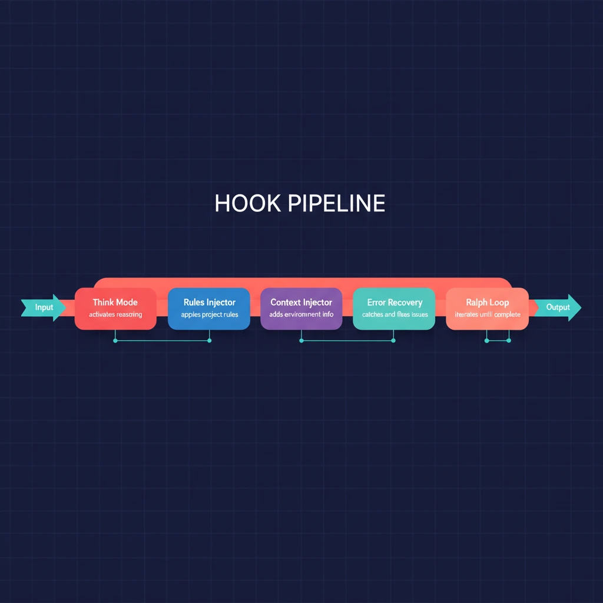

# 第五章：Hook 管道 — 在你不知道的时候增强一切

> **格言**：*"最好的基础设施是你感觉不到它存在，直到它救了你。"*

## 上回

[上一章](./ch04-specialist-agents.md)中，我们认识了 OMO 的专家团队。但这些 agents 在执行过程中，每一次工具调用、每一条消息、每一个事件，都在穿过一条**看不见的 hook 链**。

## 问题

Agent 在工作时会遇到各种情况：用户想要深度思考、项目有特定的编码规范、上下文窗口快满了、编辑工具报错了。这些都不应该由 agent 自己处理——它们应该被**透明地拦截和处理**。

## 代码路径

### Hook 的四个入口

```typescript
// src/index.ts:L300-L400
return {
  "chat.message": async (input, output) => { ... },     // 消息到达
  event: async (input) => { ... },                        // 系统事件
  "tool.execute.before": async (input, output) => { ... },// 工具执行前
  "tool.execute.after": async (input, output) => { ... }, // 工具执行后
};
```

### Think Mode：按需升级推理

```typescript
// src/hooks/think-mode/index.ts:L20-L50
export function createThinkModeHook() {
  return {
    "chat.params": async (output, sessionID) => {
      const promptText = extractPromptText(output.parts);
      if (!detectThinkKeyword(promptText)) return;
      // 检测到 "think" 关键词
      const highVariant = getHighVariant(currentModel.modelID);
      if (highVariant) {
        output.message.model = { providerID, modelID: highVariant };
        // 自动切换到更强的模型变体
      }
      const thinkingConfig = getThinkingConfig(providerID, modelID);
      if (thinkingConfig) Object.assign(output.message, thinkingConfig);
      // 注入 extended thinking 配置
    },
  };
}
```

用户消息里包含 "think" 关键词？Think Mode 自动把模型切换到高推理变体，并注入 thinking 配置。对用户完全透明。

### Rules Injector：项目规则自动注入

```typescript
// src/hooks/rules-injector/index.ts:L60-L75
export function createRulesInjectorHook(ctx: PluginInput) {
  // 当 agent 读取/写入/编辑文件时...
  // 1. findRuleFiles() - 在项目中查找 .rules 文件
  // 2. shouldApplyRule() - 根据 frontmatter 判断规则是否适用
  // 3. 把规则内容注入到工具输出中
  const TRACKED_TOOLS = ["read", "write", "edit", "multiedit"];
  // ...
}
```

当 agent 操作文件时，Rules Injector 自动查找项目中的规则文件（类似 `.cursorrules`），解析 frontmatter 里的匹配条件，然后把相关规则**注入到工具的输出**中。Agent 不需要知道规则的存在——它在下一次推理时自然会看到。

### Context Window Monitor：窗口守卫

```typescript
// src/hooks/context-window-monitor.ts
// 监控每次工具调用后的 token 使用量
// 接近上限时触发警告或自动 compact
```

### Tool Output Truncator：输出管理

```typescript
// src/hooks/tool-output-truncator.ts
// 当工具输出过大时自动截断
// 防止单次工具调用占满整个上下文窗口
```

### Directory Agents Injector：项目级 Agent 配置

```typescript
// src/hooks/directory-agents-injector/index.ts
// 检测项目目录中的 .agents 配置
// 自动注入项目特定的 agent 配置
```

### Hook 执行链

```typescript
// src/index.ts:L380-L400
"tool.execute.before": async (input, output) => {
  await questionLabelTruncator["tool.execute.before"]?.(input, output);
  await claudeCodeHooks["tool.execute.before"](input, output);
  await nonInteractiveEnv?.["tool.execute.before"](input, output);
  await commentChecker?.["tool.execute.before"](input, output);
  await directoryAgentsInjector?.["tool.execute.before"]?.(input, output);
  await rulesInjector?.["tool.execute.before"]?.(input, output);
  // ...
},

"tool.execute.after": async (input, output) => {
  await claudeCodeHooks["tool.execute.after"](input, output);
  await toolOutputTruncator?.["tool.execute.after"](input, output);
  await contextWindowMonitor?.["tool.execute.after"](input, output);
  await editErrorRecovery?.["tool.execute.after"](input, output);
  // ...
},
```

**每次工具调用都经过两道关卡**：执行前（参数修改、规则注入）和执行后（输出截断、错误恢复、诊断监控）。

### 可配置的开关

```typescript
// src/index.ts:L85
const isHookEnabled = (hookName: HookName) => !disabledHooks.has(hookName);
```

每个 hook 都可以通过配置禁用。不喜欢 think-mode？`disabled_hooks: ["think-mode"]`。

## 架构图



## 关键洞察

**Hook 是 OMO 的中间件层。** 就像 Express.js 的中间件一样，每个请求（消息/事件/工具调用）都穿过一系列处理器。但 OMO 的 hook 更精细——它们分为四个生命周期点，每个点都有不同的 hook 串。

这种设计的好处是**关注点分离**：Think Mode 不需要知道 Rules Injector 的存在，Rules Injector 不需要知道 Context Window Monitor 的存在。它们各自做自己的事，通过修改 input/output 来协作。

## 下一步

Hook 管道中有一个特别重要的 hook——当编辑工具报错时，Edit Error Recovery 会自动介入。加上 Session Recovery 和 Context Window 恢复，OMO 构建了一套完整的容错体系。

→ [第六章：错误恢复与韧性](./ch06-error-recovery.md)
