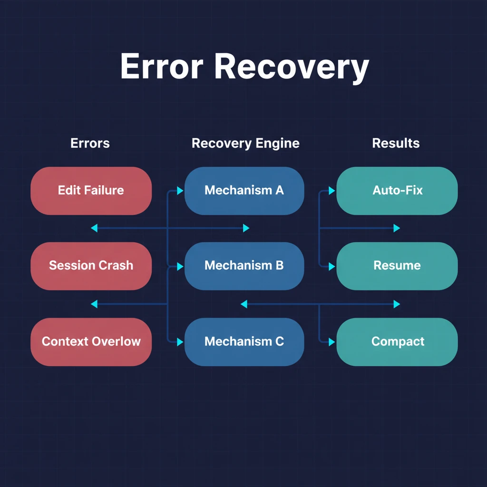

# 第六章：错误恢复与韧性 — 出错时自动修复

> **格言**：*"AI 不会不犯错，但好的 AI 知道怎么从错误中恢复。"*

## 上回

[上一章](./ch05-hook-pipeline.md)中，我们看到 hook 管道如何透明地增强每次操作。现在，agent 在重构过程中**编辑出错了**——oldString 在文件里找不到。

## 问题

AI agent 编辑代码时经常犯错：假设文件内容与实际不符、上下文窗口溢出、session 异常崩溃。如果每次出错都需要人工干预，agent 的价值就大打折扣。

## 代码路径

### Edit Error Recovery：编辑失败自动修复

```typescript
// src/hooks/edit-error-recovery/index.ts:L8-L12
export const EDIT_ERROR_PATTERNS = [
  "oldString and newString must be different",
  "oldString not found",
  "oldString found multiple times",
] as const;
```

三种经典错误模式。当检测到时：

```typescript
// src/hooks/edit-error-recovery/index.ts:L30-L50
export function createEditErrorRecoveryHook(_ctx: PluginInput) {
  return {
    "tool.execute.after": async (input, output) => {
      if (input.tool.toLowerCase() !== "edit") return;
      const hasEditError = EDIT_ERROR_PATTERNS.some((pattern) =>
        outputLower.includes(pattern.toLowerCase())
      );
      if (hasEditError) {
        output.output += `\n${EDIT_ERROR_REMINDER}`;
      }
    },
  };
}
```

恢复指令被**追加到工具输出**中，agent 在下一次推理时会看到：

```
[EDIT ERROR - IMMEDIATE ACTION REQUIRED]
1. READ the file immediately to see its ACTUAL current state
2. VERIFY what the content really looks like
3. CONTINUE with corrected action based on the real file content
```

不是重试，是**强制 agent 重新阅读文件后再行动**。

### Session Recovery：会话崩溃恢复

```typescript
// src/hooks/session-recovery/index.ts:L45-L55
// 可恢复的错误类型：
type RecoveryErrorType =
  | "tool_result_missing"     // 工具结果丢失
  | "thinking_block_order"    // thinking block 顺序错误
  | "thinking_disabled_violation" // thinking 被禁用但出现了
  | null;
```

当 session 因为 API 错误崩溃时：

```typescript
// src/index.ts:L420-L435
if (event.type === "session.error") {
  if (sessionRecovery?.isRecoverableError(error)) {
    const recovered = await sessionRecovery.handleSessionRecovery(messageInfo);
    if (recovered && sessionID === getMainSessionID()) {
      // 自动发送 "continue" 恢复工作
      await ctx.client.session.prompt({
        path: { id: sessionID },
        body: { parts: [{ type: "text", text: "continue" }] },
      });
    }
  }
}
```

Session Recovery 会修复消息结构（补全缺失的工具结果、修复 thinking block 顺序），然后自动发送 "continue" 让 agent 继续工作。用户可能根本没注意到 session 崩溃过。

### Anthropic Context Window Limit Recovery：上下文溢出恢复

```typescript
// src/hooks/anthropic-context-window-limit-recovery/index.ts:L30-L50
export function createAnthropicContextWindowLimitRecoveryHook(ctx, options?) {
  // 当 Anthropic API 返回 token limit 错误时：
  // 1. parseAnthropicTokenLimitError() 解析错误
  // 2. autoCompactState 记录需要压缩的 session
  // 3. executeCompact() 自动压缩上下文
  // 4. 压缩完成后自动重新发送请求
}
```

上下文窗口满了？不需要手动创建新 session——这个 hook 自动解析错误、压缩上下文、重试请求。

### Delegate Task Retry：委派任务重试

```typescript
// src/hooks/delegate-task-retry/index.ts
// 当 delegate_task 失败时自动重试
// 利用 session_id 续接，保留之前的上下文
```

### 三层恢复体系

| 层级 | Hook | 恢复对象 |
|------|------|----------|
| 工具级 | Edit Error Recovery | 单次编辑失败 |
| 会话级 | Session Recovery | Session 崩溃/API 错误 |
| 上下文级 | Context Window Limit Recovery | Token 超限 |
| 任务级 | Delegate Task Retry | 子任务执行失败 |

## 架构图



## 关键洞察

**OMO 的恢复策略不是"重试"——是"理解错误后修正"。** Edit Error Recovery 不是简单重试编辑操作，而是强制 agent 先读取文件的实际状态。Session Recovery 不是重启 session，而是修复消息结构后继续。Context Window Recovery 不是放弃，而是自动压缩后重试。

每一层恢复都是**语义感知**的——它理解错误的含义，然后采取最合适的修复措施。

## 下一步

如果任务太大，单线程执行太慢怎么办？OMO 可以在后台同时运行多个 agent。

→ [第七章：后台执行](./ch07-background-agents.md)
