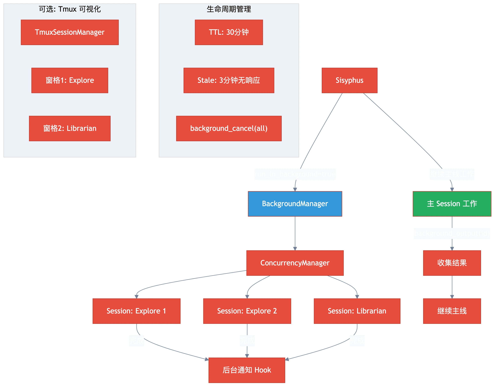

# 第七章：后台执行 — 并行运行多个 Agent

> **格言**：*"一个 Agent 是线程，多个 Agent 是并发。真正的生产力在于并行。"*

## 上回

[上一章](./ch06-error-recovery.md)中，我们看到 OMO 如何自动从各种错误中恢复。现在，Sisyphus 发现重构任务太大了——它需要同时搜索多个模块的代码、同时执行多个不相互依赖的子任务。

## 问题

OpenCode 默认是单线程的——一次只能有一个 agent 在工作。但很多工作是可以并行的：搜索代码时可以同时查多个方向，修改多个独立文件时可以同时进行。

## 代码路径

### BackgroundManager：后台任务管理器

```typescript
// src/features/background-agent/manager.ts:L55-L80
export class BackgroundManager {
  private tasks: Map<string, BackgroundTask>;
  private concurrencyManager: ConcurrencyManager;
  
  constructor(ctx: PluginInput, config?: BackgroundTaskConfig) {
    this.tasks = new Map();
    this.client = ctx.client;
    this.concurrencyManager = new ConcurrencyManager(config);
  }

  async launch(input: LaunchInput): Promise<BackgroundTask> {
    // 创建一个新的 OpenCode session
    // 在后台运行 agent
    // 返回 task ID 供后续查询
  }
}
```

BackgroundManager 通过 OpenCode 的 session API 创建独立的子 session，每个子 session 运行一个独立的 agent。它们共享文件系统但拥有**独立的上下文窗口**。

### 并发控制

```typescript
// src/features/background-agent/concurrency.ts
export class ConcurrencyManager {
  // 控制同时运行的后台任务数量
  // 队列管理：超出并发限制的任务排队等待
}
```

### 后台工具

```typescript
// src/index.ts:L195
const backgroundTools = createBackgroundTools(backgroundManager, ctx.client);
// 注册工具：background_output(task_id) - 获取后台任务结果
//          background_cancel(task_id/all) - 取消后台任务
```

### Sisyphus 的并行模式

```typescript
// src/agents/sisyphus.ts (prompt 内)
// Explore/Librarian = Grep, not consultants.
// CORRECT: Always background, always parallel
delegate_task(subagent_type="explore", run_in_background=true, prompt="Find auth...")
delegate_task(subagent_type="explore", run_in_background=true, prompt="Find errors...")
delegate_task(subagent_type="librarian", run_in_background=true, prompt="Find JWT docs...")
// Continue working immediately. Collect with background_output when needed.
```

**关键规则**：Explore 和 Librarian **总是后台运行**。它们是"grep"——你不会等 grep 命令返回后才继续工作。

### TmuxSessionManager：终端多路复用

```typescript
// src/features/tmux-subagent/manager.ts
export class TmuxSessionManager {
  // 可选功能：在 tmux 窗格中可视化后台 agents
  // 用户可以看到每个 agent 在做什么
  constructor(ctx, config) {
    this.enabled = config.enabled; // 默认 false
    this.layout = config.layout;   // 'main-vertical' etc.
  }
}
```

### 任务生命周期

```typescript
// src/features/background-agent/manager.ts
const TASK_TTL_MS = 30 * 60 * 1000;          // 任务最长 30 分钟
const MIN_STABILITY_TIME_MS = 10 * 1000;      // 至少运行 10 秒
const DEFAULT_STALE_TIMEOUT_MS = 180_000;     // 3 分钟无响应视为 stale
```

### 后台通知

```typescript
// src/hooks/background-notification/index.ts
// 当后台任务完成或失败时，通知主 session
// Sisyphus 可以决定是否需要收集结果
```

## 架构图



## 关键洞察

**后台 agent 不是"另一个 tab"——是结构化的并发。** BackgroundManager 控制并发数、管理任务生命周期、处理超时和 stale 检测。每个后台 agent 都有独立的 session，互不干扰。

Sisyphus 的工作模式是：发射 3-5 个 explore/librarian 到后台，自己继续做其他工作，需要结果时用 `background_output` 收集。这不是"异步等待"——是**真正的并行工作流**。

## 下一步

这些 agent 的 prompt 不是写死的——它们是根据当前可用的 agent、tool、skill 动态组装的。

→ [第八章：动态 Prompt 组装](./ch08-dynamic-prompts.md)
