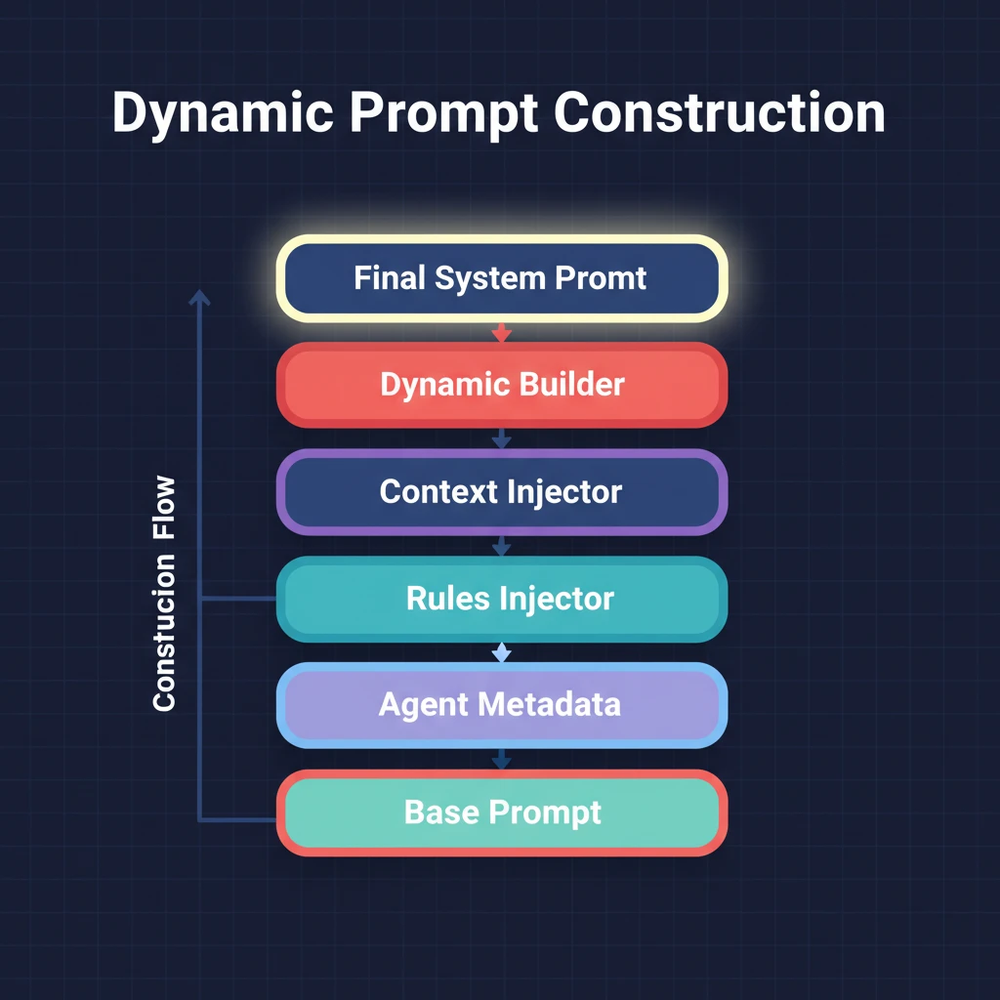

# 第八章：动态 Prompt 组装 — 每个 Agent 的 Prompt 都是现场拼的

> **格言**：*"写死的 prompt 是债务，动态的 prompt 是资产。"*

## 上回

[上一章](./ch07-background-agents.md)中，我们看到后台 agent 系统如何实现并行执行。但这些 agent 的 prompt 到底是怎么来的？

## 问题

OMO 的 agent 团队是可配置的——用户可以禁用某些 agent、添加新的 category、注册 skill。如果 Sisyphus 的 prompt 里硬编码了"有 Oracle, Explore, Librarian 可用"，当用户禁用了 Librarian 时，Sisyphus 会试图调用一个不存在的 agent。

## 代码路径

### 动态构建器入口

```typescript
// src/agents/sisyphus.ts:L5-L15
import {
  buildKeyTriggersSection,
  buildToolSelectionTable,
  buildExploreSection,
  buildLibrarianSection,
  buildDelegationTable,
  buildCategorySkillsDelegationGuide,
  buildOracleSection,
  buildHardBlocksSection,
  buildAntiPatternsSection,
  categorizeTools,
} from "./dynamic-agent-prompt-builder"
```

Sisyphus 的 prompt 由**十几个函数**拼接而成，每个函数负责一段。

### buildKeyTriggersSection：触发器

```typescript
// src/agents/dynamic-agent-prompt-builder.ts:L75-L85
export function buildKeyTriggersSection(agents: AvailableAgent[]): string {
  const keyTriggers = agents
    .filter((a) => a.metadata.keyTrigger)
    .map((a) => `- ${a.metadata.keyTrigger}`);
  if (keyTriggers.length === 0) return "";
  return `### Key Triggers:\n${keyTriggers.join("\n")}`;
}
```

只有**实际可用**的 agent 的 keyTrigger 会出现在 prompt 里。禁用了 Librarian？"External library mentioned → fire librarian" 就不会出现。

### buildToolSelectionTable：工具选择矩阵

```typescript
// src/agents/dynamic-agent-prompt-builder.ts:L90-L120
export function buildToolSelectionTable(agents, tools, skills): string {
  const rows = [];
  rows.push("| Resource | Cost | When to Use |");
  // 添加可用工具
  if (tools.length > 0) {
    const toolsDisplay = formatToolsForPrompt(tools);
    rows.push(`| ${toolsDisplay} | FREE | Not Complex, Scope Clear |`);
  }
  // 添加可用 agent（按成本排序）
  for (const agent of sortedAgents) {
    rows.push(`| \`${agent.name}\` | ${agent.metadata.cost} | ${shortDesc} |`);
  }
  return rows.join("\n");
}
```

Sisyphus 看到的工具矩阵是**实时生成**的——当前有哪些 LSP 工具、有哪些 agent、它们的成本是多少，全部根据实际可用情况动态生成。

### buildDelegationTable：委派矩阵

```typescript
// src/agents/dynamic-agent-prompt-builder.ts:L140-L155
export function buildDelegationTable(agents: AvailableAgent[]): string {
  for (const agent of agents) {
    for (const trigger of agent.metadata.triggers) {
      rows.push(`| ${trigger.domain} | \`${agent.name}\` | ${trigger.trigger} |`);
    }
  }
}
```

### Agent Prompt Metadata：自描述元数据

```typescript
// src/agents/oracle.ts:L5-L15
export const ORACLE_PROMPT_METADATA: AgentPromptMetadata = {
  category: "advisor",
  cost: "EXPENSIVE",
  promptAlias: "Oracle",
  triggers: [
    { domain: "Architecture decisions", trigger: "Multi-system tradeoffs" },
    { domain: "Self-review", trigger: "After significant implementation" },
    { domain: "Hard debugging", trigger: "After 2+ failed fix attempts" },
  ],
  useWhen: ["Complex architecture design", "2+ failed fix attempts", ...],
  avoidWhen: ["Simple file operations", "First attempt at any fix", ...],
};
```

每个 agent 都携带自己的元数据——描述自己是什么、什么时候该用、什么时候不该用。Sisyphus 的 prompt 从这些元数据中**自动提取信息**。

### buildCategorySkillsDelegationGuide：Skill 系统

```typescript
// src/agents/dynamic-agent-prompt-builder.ts:L160-L220
export function buildCategorySkillsDelegationGuide(categories, skills): string {
  // 列出所有可用 category 及其描述
  // 列出所有可用 skill 及其专业领域
  // 生成 "MANDATORY: Evaluate ALL skills for relevance" 指南
}
```

### 最终组装

```typescript
// src/agents/sisyphus.ts:L18-L30
function buildDynamicSisyphusPrompt(availableAgents, availableTools, availableSkills, availableCategories): string {
  const keyTriggers = buildKeyTriggersSection(availableAgents, availableSkills);
  const toolSelection = buildToolSelectionTable(availableAgents, availableTools, availableSkills);
  const exploreSection = buildExploreSection(availableAgents);
  // ...8 个 section 拼成最终 prompt
  return `<Role>You are "Sisyphus"...</Role>
    <Behavior_Instructions>
    ${keyTriggers}
    ${toolSelection}
    ${exploreSection}
    ...
    </Behavior_Instructions>`;
}
```

## 架构图



## 关键洞察

**每个 agent 都参与了 Sisyphus prompt 的编写。** 当 Oracle 定义了 `ORACLE_PROMPT_METADATA` 里的 triggers 和 useWhen 时，它实际上在告诉 Sisyphus："在这些情况下叫我"。这不是 Sisyphus 硬编码的——是每个 agent **自我声明**后，由构建器自动编排。

这意味着添加一个新 agent 不需要修改 Sisyphus 的代码——只要定义好 `AgentPromptMetadata`，新 agent 就会自动出现在 Sisyphus 的工具矩阵和委派表里。

## 下一步

动态 prompt 告诉 agent 有哪些工具可用。但 OMO 的工具不只是 OpenCode 内置的——还有更强大的 AST 搜索、LSP 集成和交互式 bash。

→ [第九章：增强工具](./ch09-crafted-tools.md)
