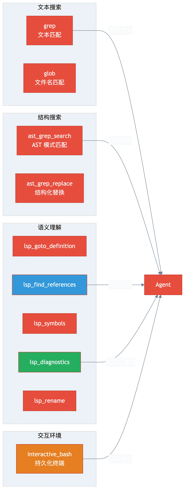

# 第九章：增强工具 — AST、LSP 与交互式 Bash

> **格言**：*"grep 找文本，AST 找结构，LSP 找语义。三者齐上，代码无处遁形。"*

## 上回

[上一章](./ch08-dynamic-prompts.md)中，我们看到 Sisyphus 的 prompt 如何动态组装。prompt 告诉 agent 有哪些工具可用——这一章看看这些工具有多强。

## 问题

OpenCode 内置的 `grep` 和 `read` 够用吗？对于简单搜索是的。但重构需要**结构感知搜索**（"找到所有接受两个参数的 export function"）、**语义理解**（"这个函数在哪里被引用？"）和**持久化的终端会话**。

## 代码路径

### ast_grep_search：AST 感知的代码搜索

```typescript
// src/tools/ast-grep/tools.ts:L35-L50
export const ast_grep_search: ToolDefinition = tool({
  description: "Search code patterns across filesystem using AST-aware matching. "
    + "Supports 25 languages. Use meta-variables: $VAR (single node), $$$ (multiple nodes).",
  args: {
    pattern: tool.schema.string().describe("AST pattern with meta-variables"),
    lang: tool.schema.enum(CLI_LANGUAGES),
    paths: tool.schema.array(tool.schema.string()).optional(),
    globs: tool.schema.array(tool.schema.string()).optional(),
    context: tool.schema.number().optional(),
  },
  execute: async (args, context) => {
    const result = await runSg({ pattern: args.pattern, lang: args.lang, ... });
    let output = formatSearchResult(result);
    // 空结果时提供智能提示
    const hint = getEmptyResultHint(args.pattern, args.lang);
    if (hint) output += `\n${hint}`;
    return output;
  },
});
```

`ast_grep_search` 底层调用 [ast-grep](https://ast-grep.github.io/) CLI。它理解代码结构：

```
// 找到所有 export async function
pattern: "export async function $NAME($$$) { $$$ }"

// 找到所有 console.log 调用
pattern: "console.log($MSG)"

// 找到所有 Python 类定义
pattern: "class $NAME:" lang: "python"
```

还有 `ast_grep_replace`（支持 `dryRun=true` 预览）用于结构化的代码替换。

**智能提示**：当搜索无结果时，会检查常见错误：

```typescript
// src/tools/ast-grep/tools.ts:L15-L30
function getEmptyResultHint(pattern, lang) {
  if (lang === "python" && src.endsWith(":")) {
    return `Hint: Remove trailing colon. Try: "${withoutColon}"`;
  }
  if (/^(export\s+)?(async\s+)?function\s+\$[A-Z_]+\s*$/i.test(src)) {
    return 'Hint: Function patterns need params and body.';
  }
}
```

### LSP 工具集：IDE 级别的语义理解

```typescript
// src/tools/lsp/index.ts
export {
  lsp_goto_definition,    // 跳转到定义
  lsp_find_references,    // 查找所有引用
  lsp_symbols,            // 列出文件/项目符号
  lsp_diagnostics,        // 获取诊断信息（错误、警告）
  lsp_prepare_rename,     // 检查是否可以重命名
  lsp_rename,             // 安全重命名符号
}
```

这些工具连接到真实的 Language Server。`lsp_find_references` 不是 grep——它通过 TypeScript Language Server 找到**所有语义引用**，包括类型引用、import、re-export。

`lsp_diagnostics` 是 Sisyphus 的验证命令——每次修改后都要运行它确认没有类型错误。

### interactive_bash：持久化终端

```typescript
// src/tools/interactive-bash/index.ts
export { interactive_bash, startBackgroundCheck }
```

`interactive_bash` 不是普通的 `exec`——它维护一个**持久化的 bash session**。环境变量、工作目录、后台进程都在 session 之间保留。

配套的 hook 确保 session 的正确管理：

```typescript
// src/hooks/interactive-bash-session/index.ts
// 跟踪活跃的 bash session
// 在 session 结束时清理
// 在工具调用前/后维护状态
```

### 工具分类

```typescript
// src/agents/dynamic-agent-prompt-builder.ts:L35-L50
export function categorizeTools(toolNames: string[]): AvailableTool[] {
  return toolNames.map((name) => {
    if (name.startsWith("lsp_")) return { name, category: "lsp" };
    if (name.startsWith("ast_grep")) return { name, category: "ast" };
    if (name === "grep" || name === "glob") return { name, category: "search" };
    if (name.startsWith("session_")) return { name, category: "session" };
    return { name, category: "other" };
  });
}
```

### 工具能力对比

| 工具 | 搜索方式 | 最佳场景 |
|------|----------|----------|
| `grep` | 文本匹配 | 字符串、注释、日志 |
| `glob` | 文件名匹配 | 按名称/扩展名查找文件 |
| `ast_grep_search` | AST 结构匹配 | 函数签名、代码模式 |
| `lsp_find_references` | 语义引用 | 重构前影响分析 |
| `lsp_diagnostics` | 类型检查 | 修改后验证 |
| `lsp_rename` | 语义重命名 | 安全的符号重命名 |

## 架构图



## 关键洞察

**OMO 的工具不是"更好的 shell 命令"——是"IDE 能力的 API 化"。** LSP 工具给了 agent 等同于 VS Code 的语义理解能力：跳转到定义、查找引用、安全重命名、实时诊断。AST-grep 给了结构搜索能力。这些组合在一起，让 agent 做重构时能做到：先用 `lsp_find_references` 了解影响面，用 `ast_grep` 找到所有模式，修改后用 `lsp_diagnostics` 验证。

这就是为什么 OMO 的 Sisyphus prompt 里说"your code should be indistinguishable from a senior engineer's"——因为它有一个高级工程师的工具箱。

## 下一步

很多用户从 Claude Code 迁移到 OpenCode。OMO 如何让迁移无缝？

→ [第十章：CC 兼容层](./ch10-cc-compatibility.md)
