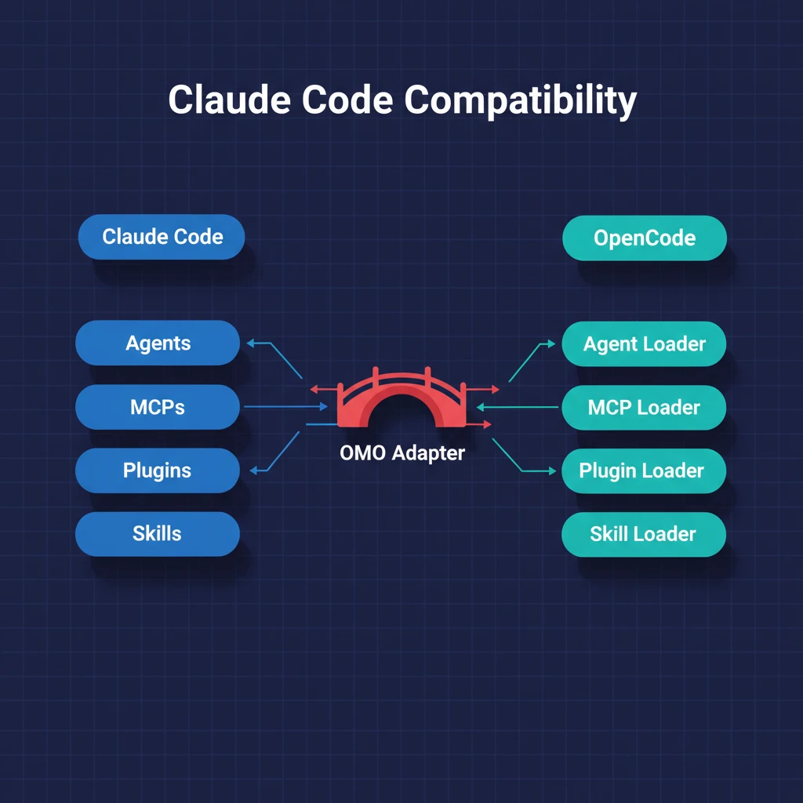

# 第十章：CC 兼容层 — Claude Code 用户的无缝迁移

> **格言**：*"不要让用户改变习惯来适应工具，让工具适应用户的习惯。"*

## 上回

[上一章](./ch09-crafted-tools.md)中，我们看到 OMO 提供的 AST/LSP/interactive-bash 工具集。但很多 OMO 用户来自 Claude Code 生态——他们有 `.claude` 目录、CLAUDE.md 文件、Claude Code 的 hooks 和 MCP 配置。

## 问题

用户从 Claude Code 迁移到 OpenCode + OMO 时，不应该重新配置一切。他们已有的 CLAUDE.md、.claude/settings.json、自定义 hooks、MCP servers 应该直接可用。

## 代码路径

### Claude Code Hooks 适配

```typescript
// src/hooks/claude-code-hooks/index.ts
export function createClaudeCodeHooksHook(ctx, config, contextCollector) {
  // 加载 Claude Code 的 hook 配置
  // 适配到 OpenCode 的 hook 接口
  // 支持: pre-tool-use, post-tool-use, stop, user-prompt-submit
}
```

这个"hooks 的 hook"是一个适配层——它读取 Claude Code 格式的 hook 配置，然后在 OMO 的 hook 管道中执行它们：

```typescript
// src/hooks/claude-code-hooks/pre-tool-use.ts   — 工具执行前
// src/hooks/claude-code-hooks/post-tool-use.ts  — 工具执行后
// src/hooks/claude-code-hooks/stop.ts           — 停止条件
// src/hooks/claude-code-hooks/user-prompt-submit.ts — 用户提交消息
// src/hooks/claude-code-hooks/todo.ts           — Todo 管理
// src/hooks/claude-code-hooks/transcript.ts     — 对话记录
```

### Claude Code Agent Loader

```typescript
// src/features/claude-code-agent-loader/loader.ts
// 发现并加载 .claude/ 目录中定义的自定义 agent
// 转换为 OpenCode agent 格式
```

### Claude Code Command Loader

```typescript
// src/features/claude-code-command-loader/loader.ts
// 加载 Claude Code 格式的自定义命令
// 注册为 OpenCode 的 slash command
```

### Claude Code MCP Loader

```typescript
// src/features/claude-code-mcp-loader/loader.ts
// 读取 .claude/settings.json 中的 MCP server 配置
// 转换为 OpenCode 的 MCP 格式
```

```typescript
// src/features/claude-code-mcp-loader/env-expander.ts
// 展开环境变量引用
// 支持 Claude Code 的 env 配置格式
```

### Session State 管理

```typescript
// src/features/claude-code-session-state/state.ts
// 管理 session 级别的状态
// 跟踪主 session、子 session、agent 分配
export function setMainSession(id?: string): void
export function getMainSessionID(): string | undefined
export function setSessionAgent(sessionID: string, agent: string): void
```

### Skill 加载器

```typescript
// src/features/opencode-skill-loader/index.ts
export {
  discoverUserClaudeSkills,      // ~/.claude/ 下的 skill
  discoverProjectClaudeSkills,   // 项目 .claude/ 下的 skill
  discoverOpencodeGlobalSkills,  // OpenCode 全局 skill
  discoverOpencodeProjectSkills, // 项目级 OpenCode skill
  mergeSkills,                   // 合并所有来源的 skill，去重
}
```

OMO 从四个位置加载 skill，然后合并去重：

```typescript
// src/index.ts:L230-L240
const [userSkills, globalSkills, projectSkills, opencodeProjectSkills] = await Promise.all([
  includeClaudeSkills ? discoverUserClaudeSkills() : Promise.resolve([]),
  discoverOpencodeGlobalSkills(),
  includeClaudeSkills ? discoverProjectClaudeSkills() : Promise.resolve([]),
  discoverOpencodeProjectSkills(),
]);
const mergedSkills = mergeSkills(builtinSkills, pluginConfig.skills, userSkills, globalSkills, ...);
```

### 兼容层开关

```typescript
// src/index.ts:L225
const includeClaudeSkills = pluginConfig.claude_code?.skills !== false;
```

用户可以通过配置关闭 Claude Code 兼容层。

## 架构图



## 关键洞察

**兼容层不是妥协——是尊重用户投入。** Claude Code 用户可能花了几周配置 hooks、编写 CLAUDE.md、设置 MCP servers。OMO 的兼容层确保这些投入不会白费——直接迁移，直接可用。

同时，这也是 OMO 的扩展点。Claude Code 的 hook 系统被适配后，OMO 的 hook 管道就同时支持两种格式的 hook——原生 OMO hook 和 Claude Code hook。用户可以渐进式迁移，也可以永远不迁移。

## 下一步

所有的机制都就位了：agent 团队、hook 管道、错误恢复、后台执行。最后一个问题——如何让一个任务**自动运行到完成**，不需要人工干预？

→ [第十一章：Ralph Loop](./ch11-ralph-loop.md)
