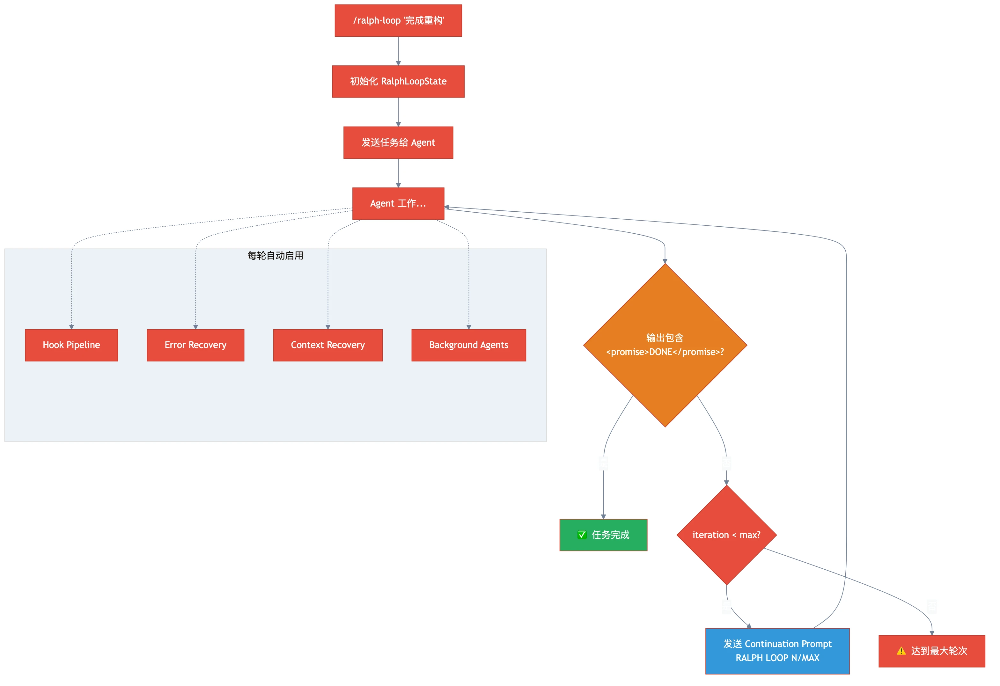

# 第十一章：Ralph Loop — "跑到完成"的杀手级功能

> **格言**：*"Ralph 不需要你盯着。给它一个任务，它会循环到完成——或者告诉你它真的做不到。"*

## 上回

[上一章](./ch10-cc-compatibility.md)中，我们看到 OMO 如何兼容 Claude Code 的生态。所有组件都就位了。现在我们来看 OMO 最核心的功能——把一切串在一起的"最终循环"。

## 问题

AI agent 有个通病：干到一半就停了。模型输出结束了，但任务还没完成。用户得手动说"继续"。如果这个任务要运行 20 轮呢？Ralph Loop 解决的就是这个问题——**自动循环直到任务真正完成**。

## 代码路径

### 启动 Ralph Loop

```typescript
// src/hooks/ralph-loop/index.ts:L70-L80
export interface RalphLoopHook {
  event: (input) => Promise<void>;
  startLoop: (sessionID: string, prompt: string, options?: {
    maxIterations?: number;
    completionPromise?: string;
    ultrawork?: boolean;
  }) => boolean;
  cancelLoop: (sessionID: string) => boolean;
  getState: () => RalphLoopState | null;
}
```

用户可以通过 `/ralph-loop "完成这个重构"` 启动，也可以通过消息模板触发：

```typescript
// src/index.ts:L310-L340
// 检测 Ralph Loop 模板消息
const isRalphLoopTemplate = promptText.includes("You are starting a Ralph Loop")
  && promptText.includes("<user-task>");
if (isRalphLoopTemplate) {
  const taskMatch = promptText.match(/<user-task>\s*([\s\S]*?)\s*<\/user-task>/i);
  const prompt = quotedMatch?.[1] || rawTask.split(/\s+--/)[0]?.trim();
  ralphLoop.startLoop(input.sessionID, prompt, {
    maxIterations: maxIterMatch ? parseInt(maxIterMatch[1], 10) : undefined,
    completionPromise: promiseMatch?.[1],
  });
}
```

### 核心状态

```typescript
// src/hooks/ralph-loop/types.ts
export interface RalphLoopState {
  active: boolean;
  iteration: number;
  max_iterations: number;        // 默认 100
  completion_promise: string;    // 默认 "DONE"
  started_at: string;
  prompt: string;
  session_id?: string;
  ultrawork?: boolean;           // 超级工作模式
}
```

### 循环逻辑

```typescript
// src/hooks/ralph-loop/index.ts (event handler)
// 每次 agent 的响应完成后：
// 1. 检查输出是否包含 <promise>DONE</promise>
// 2. 如果包含 → 循环结束，任务完成
// 3. 如果不包含 → iteration++，发送 continuation prompt
```

### Continuation Prompt：继续工作

```typescript
// src/hooks/ralph-loop/index.ts:L55-L65
const CONTINUATION_PROMPT = `[SYSTEM DIRECTIVE - RALPH LOOP {{ITERATION}}/{{MAX}}]

Your previous attempt did not output the completion promise. Continue working on the task.

IMPORTANT:
- Review your progress so far
- Continue from where you left off
- When FULLY complete, output: <promise>{{PROMISE}}</promise>
- Do not stop until the task is truly done

Original task:
{{PROMPT}}`
```

每次循环，agent 都能看到：当前是第几轮、总共多少轮、原始任务是什么。这确保了**上下文连续性**。

### Completion Promise：完成信号

```typescript
// src/hooks/ralph-loop/constants.ts
export const COMPLETION_TAG_PATTERN = /<promise>(.*?)<\/promise>/is;
export const DEFAULT_COMPLETION_PROMISE = "DONE";
export const DEFAULT_MAX_ITERATIONS = 100;
```

Agent 在真正完成时输出 `<promise>DONE</promise>`。这是一个**明确的、可解析的完成信号**——不是模糊的"我做完了"，而是结构化的标记。

### 持久化状态

```typescript
// src/hooks/ralph-loop/storage.ts
// readState() / writeState() / clearState() / incrementIteration()
// 状态保存在 .sisyphus/ralph-loop.local.md
```

Ralph Loop 的状态持久化到文件——即使进程重启，也能恢复循环。

### ULW Loop：超级工作模式

```typescript
// src/index.ts:L350-L360
} else if (command === "ulw-loop" && sessionID) {
  ralphLoop.startLoop(sessionID, prompt, {
    ultrawork: true,  // 启用更积极的工作模式
    maxIterations: ...,
    completionPromise: ...,
  });
}
```

### 安全机制

| 机制 | 作用 |
|------|------|
| `max_iterations` | 防止无限循环（默认 100） |
| `completion_promise` | 明确的完成信号，不靠猜测 |
| `/cancel-ralph` | 用户可以随时取消 |
| 持久化状态 | 进程重启后可恢复 |

## 架构图



## 关键洞察

**Ralph Loop 是 OMO 所有功能的"粘合剂"。** 在循环的每一轮里：
- **Hook 管道**拦截每次工具调用（think-mode, rules-injection, error recovery）
- **Error Recovery** 自动处理编辑失败和 session 崩溃
- **Context Window Recovery** 在上下文溢出时自动压缩
- **Background Agents** 可以并行搜索和执行
- **Dynamic Prompts** 确保每轮都有正确的工具信息

Ralph Loop 不是一个独立功能——它是让前面十章所有机制**持续运转**的循环引擎。给它一个任务，它就会调用前面所有的机制，一轮一轮推进，直到 agent 输出那个 `<promise>DONE</promise>`。

这就是 OMO 的承诺：**给我一个任务，我会一直干到完成。**

## 故事的终点

你说"帮我重构这个模块"。Plugin 启动，Sisyphus 分析任务、委派给专家、Hook 管道增强每一步操作、错误恢复处理意外、后台 agent 并行工作、Ralph Loop 确保不停歇——直到重构完成。

从 `index.ts` 的第一行，到 `<promise>DONE</promise>` 的最后一个标记。这就是 Oh My OpenCode 的完整旅程。

---

← [第十章：CC 兼容层](./ch10-cc-compatibility.md) | [返回 README](../../README-zh.md)
